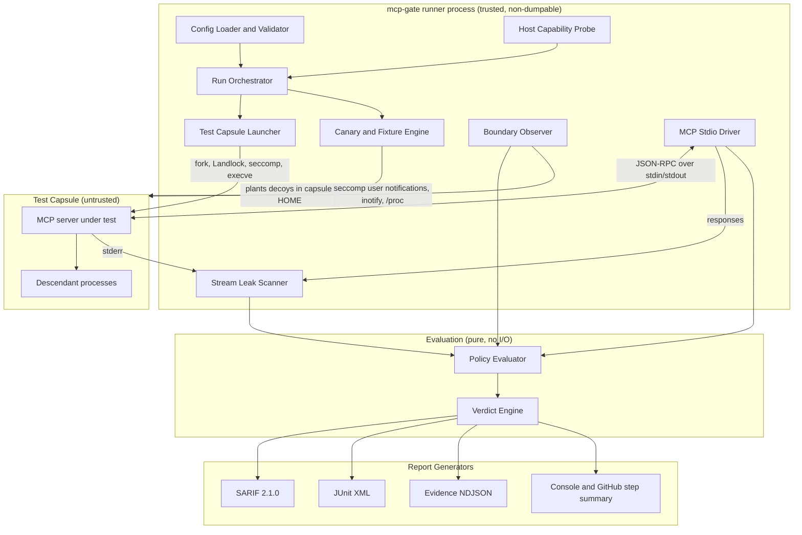
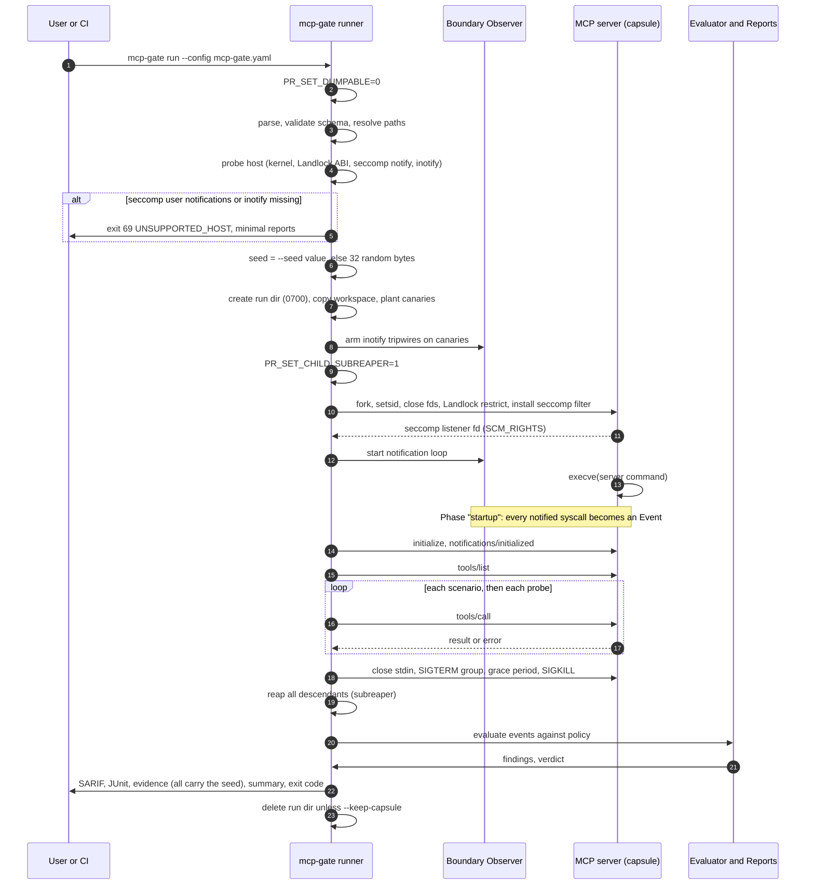
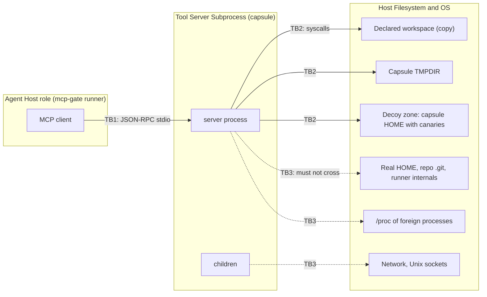

# mcp-gate: Technical Specification

> mcp-gate: Linux capability-policy regression testing for MCP integration scenarios.
>
> An unprivileged CI harness that runs local MCP stdio tool servers in a test capsule and reports boundary violations as SARIF and JUnit.

| Field | Value |
|---|---|
| Document status | Draft v0.2, single source of truth for TDD (changelog in Appendix E) |
| Spec version | `1.0.0-draft` |
| Target release | mcp-gate v1.0 (end of Month 6) |
| Funding context | Prototype Fund (BMBF), focus areas Datensicherheit and Software-Infrastruktur |
| Team | One developer, six months |
| License (proposed) | Apache-2.0 |
| Primary platform | Linux x86_64 on GitHub-hosted `ubuntu-latest`, `aarch64` as a stretch goal |
| Implementation language | Rust (stable, MSRV pinned in `rust-toolchain.toml`) |

### How to read this document

Every normative requirement carries an ID such as `REQ-LAUNCH-004`. Every test in Section 4 references the requirement IDs it proves. A requirement with no test is treated as a defect in this spec. The keywords MUST, SHOULD and MAY follow RFC 2119.

When the code and this file disagree, the file wins until someone changes it in a reviewed commit. Change the spec first, then the test, then the code.

### Claims policy

mcp-gate reports what it observed during one run, under one capability profile, on one host. It never claims a server is "secure", "safe" or "certified". A PASS verdict means exactly this: *no finding at or above the configured threshold was observed in the scenarios that ran, with the observer coverage listed in the report.* All report templates MUST carry that sentence (`REQ-CLAIM-001`).

---

## Table of contents

1. [Architecture and threat model](#1-architecture-and-threat-model)
2. [CLI and configuration specification](#2-cli-and-configuration-specification)
3. [Core component descriptions](#3-core-component-descriptions)
4. [TDD roadmap and test matrix](#4-test-driven-development-roadmap-and-test-matrix)
5. [Six-month implementation milestones](#5-six-month-prototype-fund-implementation-milestones)
6. [Appendices](#6-appendices)

---

## 1. Architecture and threat model

### 1.1 Problem in one paragraph

A local MCP server is a child process that an agent host (Cursor, Claude Code, OpenDevin and others) starts over stdio. It inherits the user's UID, environment, working directory and file descriptors. Nothing in the protocol limits what it can read, write, run or connect to. One compromised transitive dependency, or one tool argument shaped by a prompt injection, is enough to read `~/.ssh/id_ed25519` or `~/.aws/credentials` and send it somewhere. Static linters read source and miss runtime behavior. Production sandboxes are heavy and need privileges developers will not grant. mcp-gate sits in the gap: it runs the server the way an agent host would, inside a disposable capsule, watches what it touches, and writes the result as SARIF and JUnit so it shows up in pull requests.

### 1.2 Design principles

1. Unprivileged only. No root, no setuid helpers, no Docker, no eBPF, no user namespaces as a hard requirement.
2. Observe first, enforce second. Enforcement (Landlock, seccomp denials) protects the host. Observation produces the evidence. Both are on by default, and they are reported separately.
3. One observer, done well. Observation uses seccomp user notifications plus inotify and nothing else. If the kernel cannot support that, the run stops with exit 69 (`UNSUPPORTED_HOST`) instead of producing weaker evidence. Landlock is enforcement, not observation, so a missing Landlock is reported but does not stop the run unless `--require landlock` is set.
4. Replayable randomness. Canary values come from a fresh random seed on every run, and the seed is printed in every report. Same seed, same config, same server binary, same host features: same findings, same SARIF fingerprints.
5. Hexagonal core. Policy logic, path normalization and finding generation are pure Rust with no I/O, so most tests run on any OS, including the developer's macOS laptop.

### 1.3 Component diagram



### 1.4 Process model

mcp-gate uses two process roles.

| Role | Process | Environment | Trust |
|---|---|---|---|
| Runner | `mcp-gate run ...` (CLI, orchestrator and supervisor in one process) | Whatever the CI step gives it | Trusted |
| Capsule | The MCP server and its descendants | Built from scratch: fixed variables, declared variables, decoy variables | Untrusted |

mcp-gate does not try to defend against a compromised runner host. Protecting the CI job's own secrets is the job of standard CI hygiene, which the docs and the example workflow spell out (`REQ-CI-002`):

- `actions/checkout` with `persist-credentials: false`,
- no production secrets in the job that runs mcp-gate,
- no secrets mapped into the mcp-gate step's environment,
- an explicit `env.passthrough` allowlist, never a blanket inherit.

Two cheap measures stay in v1.0 because each costs a few lines. First, the runner calls `prctl(PR_SET_DUMPABLE, 0)` on itself at startup. That makes its own `/proc/<pid>/environ` and `/proc/<pid>/mem` unreadable to the same-UID capsule (`REQ-PROC-001`). Yama's `ptrace_scope=1` does not cover this case, since it only guards attach-mode access. Second, any capsule access to `/proc/<pid>` of a process outside the capsule tree is classified as MCPG008. That is detection only. Ancestors such as the CI step's shell remain readable, which is a documented residual risk covered by the hygiene rules above.

A self re-exec into a separate scrubbed supervisor process was considered and dropped. It only protects one extra ancestor, and the hygiene rules do that job better.

### 1.5 Run lifecycle



Phases are tracked as a single cursor in the runner: `startup`, `handshake`, `scenario:<id>`, `probe:<id>`, `shutdown`. Scenarios run one at a time so that every event can be attributed to exactly one phase (`REQ-ORCH-003`). Events from background threads land in whatever phase is active when they arrive. The report says so.

### 1.6 Trust boundaries



TB1, the stdio channel. Data from the server is untrusted. mcp-gate caps line length, rejects non-JSON on stdout as a protocol finding, and scans every byte for canary material. Data from the client to the server (tool arguments) is where prompt injection lands in real deployments, so probes deliberately send hostile arguments across this boundary.

TB2, the syscall boundary. This is where the Boundary Observer sits. Everything the server does to the outside world goes through a small set of syscalls (open, exec, connect, signal and so on), and mcp-gate sees those.

TB3, the host. The real home, the checked-out repository's `.git`, the runner's `_temp` directory, the Docker socket and foreign `/proc` entries are the assets. Landlock keeps the server out of most of them. The observer records every attempt.

### 1.7 Assets

| Asset | Example locations | Why it matters |
|---|---|---|
| SSH private keys | `~/.ssh/id_*` | Push access to repositories, server access |
| Cloud credentials | `~/.aws/credentials`, `~/.config/gcloud/`, `~/.kube/config` | Full cloud account takeover |
| Package registry tokens | `~/.npmrc`, `~/.pypirc`, `~/.netrc` | Supply chain publishing |
| CI tokens | `GITHUB_TOKEN`, `ACTIONS_RUNTIME_TOKEN`, `ACTIONS_ID_TOKEN_REQUEST_*` | Repository write, OIDC federation |
| Persisted checkout credentials | `<repo>/.git/config` (`actions/checkout` with `persist-credentials: true`) | Same as `GITHUB_TOKEN` |
| Docker socket | `/var/run/docker.sock` (runner user is in the `docker` group) | Equivalent to root on the runner |
| Source outside the workspace | sibling repositories, monorepo roots, `.env` files | Confidentiality |
| The harness itself | mcp-gate process, its reports | Integrity of the verdict |

### 1.8 Adversary models

- **A1, compromised dependency.** Malicious code runs at import or startup, before any tool is called. It looks for credentials and sends them out.
- **A2, prompt-injected arguments.** The attacker controls tool arguments through the LLM. A server with a naive `os.path.join(root, user_path)` becomes a file reader for the whole disk.
- **A3, sloppy server.** No malice, just a server that spawns `sh -c`, reads `~/.netrc` through an HTTP library default, or writes caches into `$HOME`.
- **A4, harness-aware server.** Code that tries to blind or kill the harness. Partly in scope: mcp-gate blocks the cheap tricks listed in T-09 and documents the rest as residual risk.

Out of scope for v1.0: kernel exploits, attackers who already have root, side channels, behavior that only triggers after the test window, and remote Streamable HTTP servers.

### 1.9 Threat and failure mode catalogue

The four primary failure modes from the brief are T-01 to T-04. The rest came out of looking at what a GitHub runner actually exposes to a same-UID child.

| ID | Failure mode | Adversary | Detection | Enforcement | Rule |
|---|---|---|---|---|---|
| T-01 | Ambient environment inheritance: server receives and uses host secrets from env | A1, A3 | Decoy env vars injected; any decoy value seen in stdout, stderr, files written, child argv or network payloads is a leak | Env scrubbed to an allowlist | MCPG002 |
| T-02 | Unauthorized path traversal: reads or writes outside declared paths, including via `..`, symlinks, absolute paths, `file://` URIs | A2, A3 | seccomp notification on open family, kernel-like path resolution, inotify tripwire on canaries | Landlock filesystem rules | MCPG001, MCPG003, MCPG004, MCPG005 |
| T-03 | Unexpected child process spawning | A1, A2 | Notification on `execve`/`execveat`, post-exec confirmation via `/proc/<pid>/exe` | Landlock `EXECUTE` right only on allowed binaries | MCPG006 |
| T-04 | Unapproved network calls | A1 | Notification on `socket`, `connect`, `sendto` (with address), `sendmsg`, `bind` | `socket(AF_INET/AF_INET6)` denied when `allow_network: false`; Landlock TCP rules (ABI 4+) as a second layer | MCPG007 |
| T-05 | Unix socket abuse, especially the Docker socket and SSH agent | A1 | Notification on `connect` with `AF_UNIX` path | Denied unless listed in `allowed_unix_sockets` (best effort, see 3.3.6) | MCPG009 |
| T-06 | Reading the checkout's `.git/config` or runner `_temp` files | A1 | Path resolution against real repo and runner paths | Workspace is a copy without `.git` by default; Landlock blocks the original | MCPG003 |
| T-07 | Reading ancestor `/proc/<pid>/environ` or `cmdline` | A1 | Any `/proc/<pid>/` access where pid is outside the capsule tree | Runner sets itself non-dumpable; other ancestors are covered by CI hygiene (1.4), not by mcp-gate | MCPG008 |
| T-08 | Process escape: a daemonized child outlives the test | A1 | Subreaper sees orphans; any process alive after shutdown | Process group kill, then per-pid kill of all known descendants | MCPG012 |
| T-09 | Harness tampering: signalling the runner, bypassing syscall observation with `io_uring`, `ptrace`, 32-bit syscall ABI, `userfaultfd`, `bpf`, new user namespaces | A4 | Notification and recording of the attempt | Denied with `EPERM` or `ENOSYS`; foreign-arch syscalls kill the process | MCPG010 |
| T-10 | Sensitive path existence probing (`stat` on `~/.ssh`) | A1 | Optional stat-family notifications | None | MCPG011 |

---

## 2. CLI and configuration specification

### 2.1 Command structure

```text
mcp-gate <COMMAND> [OPTIONS]

Commands:
  run        Run a server in a capsule and evaluate it against its policy
  validate   Check a config file against the schema and resolve all paths
  probe      Print host isolation capabilities as JSON
  init       Generate a starter config by starting the server and listing its tools
  explain    Print the documentation for a rule ID (e.g. mcp-gate explain MCPG005)
  version    Print version, commit, build target and supported MCP protocol versions
```

#### `mcp-gate run`

| Option | Default | Meaning |
|---|---|---|
| `-c, --config <PATH>` | `./mcp-gate.yaml` | Config file |
| `--out-dir <DIR>` | `./mcp-gate-results` | Where reports go |
| `--sarif <PATH>` | `<out-dir>/mcp-gate.sarif` | SARIF output, `-` disables |
| `--junit <PATH>` | `<out-dir>/mcp-gate.junit.xml` | JUnit output, `-` disables |
| `--evidence <PATH>` | `<out-dir>/evidence.ndjson` | Full event trace |
| `--mode <enforce\|observe>` | `enforce` | `observe` turns Landlock filesystem rules off (see 3.1.5) |
| `--require <LIST>` | empty | Comma list of optional features that must be present, else exit 69. Values: `landlock`, `landlock-net`. seccomp user notifications and inotify are always required (`REQ-OBS-001`) |
| `--fail-on <LEVEL>` | `error` | Lowest SARIF level that makes the verdict FAIL: `error`, `warning`, `note` |
| `--seed <HEX>` | fresh random 32 bytes | Canary seed as 64 hex chars. Pass the seed printed by a failed run to replay it (see 3.2.4) |
| `--timeout <SECONDS>` | from config | Override the total run timeout |
| `--keep-capsule` | off | Keep the run directory for debugging |
| `--evidence-include-values` | off | Write raw canary values into evidence. Refused when `CI=true` |
| `--no-annotations` | off | Do not emit GitHub workflow commands |
| `-q, --quiet` / `-v, --verbose` | | Console verbosity |

#### `mcp-gate probe`

Prints a JSON document like this. It exits 0 when the host is supported and 69 when it is not, so a CI job can gate on it directly.

```json
{
  "kernel": "6.8.0-1021-azure",
  "arch": "x86_64",
  "landlock": { "available": true, "abi": 4 },
  "seccomp": { "filter": true, "user_notif": true, "notif_continue": true, "wait_killable_recv": true },
  "inotify": true,
  "proc_mem_readable": true,
  "supported": true,
  "missing": []
}
```

`supported` is true only when `user_notif`, `notif_continue`, `inotify` and `proc_mem_readable` are all true. `proc_mem_readable` is checked by forking a child and reading its memory through `/proc/<pid>/mem`, since the observer depends on that.

### 2.2 Configuration file

The config is YAML 1.2, parsed into a typed struct and validated against the JSON Schema in 2.3. Unknown keys are an error (`REQ-CFG-002`). There is no host environment interpolation inside the file, which keeps runs reproducible. Only these variables expand, and only at the start of path values:

| Variable | Expands to |
|---|---|
| `${WORKSPACE}` | Capsule copy of the workspace (or the original in `in-place` mode) |
| `${CAPSULE_HOME}` | Synthetic `HOME` inside the run dir (the decoy zone) |
| `${CAPSULE_TMP}` | Capsule `TMPDIR` |
| `${CONFIG_DIR}` | Directory that contains the config file |

#### Annotated example

```yaml
version: 1

server:
  name: fs-notes                      # used in report names and SARIF category
  command: /usr/bin/python3           # absolute, or resolved via PATH at load time
  args: ["${CONFIG_DIR}/server.py", "--root", "${WORKSPACE}"]
  workspace:
    source: ./fixtures/workspace      # relative to CONFIG_DIR
    mode: copy                        # copy | in-place
    exclude: [".git", "node_modules/.cache"]
  env:
    passthrough: [LANG, "LC_*"]       # copied from host if present
    set:
      NOTES_LOG_LEVEL: debug
  protocol_versions: ["2025-06-18", "2025-03-26", "2024-11-05"]
  client:
    roots: true                       # advertise the workspace as the only root

policy:
  baseline: python                    # minimal | python | node | none
  read_paths:
    - ${WORKSPACE}
    - /usr/share/zoneinfo
  write_paths:
    - ${WORKSPACE}/notes
  allowed_child_binaries:
    - /usr/bin/git
  allow_network: false
  allowed_unix_sockets: []

canaries:
  enabled: true
  kinds: [ssh, aws, gcloud, kube, docker, git_credentials, gh_cli, netrc, npmrc, pypirc, dotenv, env]
  declared_use: []                    # e.g. [aws] for a server whose job is AWS

observe:
  stat_probes: false                  # stat-family notifications (noisy)
  max_events: 200000

probes:
  path_traversal:
    enabled: true
    tools: auto                       # auto | list of tool names
  env_echo:
    enabled: true

scenarios:
  - id: write-and-read-note
    tool: write_note
    arguments: { name: "hello.md", body: "hi" }
    expect: { outcome: success }
  - id: read-note
    tool: read_note
    arguments: { name: "hello.md" }
    expect:
      outcome: success
      content_contains: ["hi"]
  - id: reject-escape
    tool: read_note
    arguments: { name: "../../etc/hostname" }
    expect: { outcome: tool_error }
  - id: sign-note                     # hypothetical tool that signs with the user's SSH key
    tool: sign_note
    arguments: { name: "hello.md" }
    canaries:
      allow_access: [ssh]             # only inside this scenario's phase, see 3.4.2
    expect: { outcome: success }

limits:
  startup_timeout_s: 30
  call_timeout_s: 30
  total_timeout_s: 600
  shutdown_grace_s: 3
  max_processes: 64
  max_stdout_line_bytes: 16777216

report:
  fail_on: error
  sarif_category: mcp-gate/fs-notes
```

### 2.3 JSON Schema (normative)

Vendored at `schema/mcp-gate.config.v1.json`. The YAML loader converts to JSON and validates with this schema before typed deserialization.

```json
{
  "$schema": "https://json-schema.org/draft/2020-12/schema",
  "$id": "https://mcp-gate.dev/schema/config/v1.json",
  "title": "mcp-gate configuration v1",
  "type": "object",
  "additionalProperties": false,
  "required": ["version", "server", "policy"],
  "properties": {
    "version": { "const": 1 },
    "server": {
      "type": "object",
      "additionalProperties": false,
      "required": ["name", "command", "workspace"],
      "properties": {
        "name": { "type": "string", "pattern": "^[a-z0-9][a-z0-9._-]{0,62}$" },
        "command": { "type": "string", "minLength": 1 },
        "args": { "type": "array", "items": { "type": "string" }, "default": [] },
        "workspace": {
          "type": "object",
          "additionalProperties": false,
          "required": ["source"],
          "properties": {
            "source": { "type": "string" },
            "mode": { "enum": ["copy", "in-place"], "default": "copy" },
            "exclude": { "type": "array", "items": { "type": "string" }, "default": [".git"] }
          }
        },
        "env": {
          "type": "object",
          "additionalProperties": false,
          "properties": {
            "passthrough": {
              "type": "array",
              "items": { "type": "string", "pattern": "^[A-Za-z_][A-Za-z0-9_]*\\*?$" },
              "default": []
            },
            "set": {
              "type": "object",
              "propertyNames": { "pattern": "^[A-Za-z_][A-Za-z0-9_]*$" },
              "additionalProperties": { "type": "string" },
              "default": {}
            },
            "allow_secret_passthrough": { "type": "boolean", "default": false }
          }
        },
        "protocol_versions": {
          "type": "array",
          "items": { "type": "string", "pattern": "^\\d{4}-\\d{2}-\\d{2}$" },
          "minItems": 1
        },
        "client": {
          "type": "object",
          "additionalProperties": false,
          "properties": { "roots": { "type": "boolean", "default": true } }
        }
      }
    },
    "policy": {
      "type": "object",
      "additionalProperties": false,
      "required": ["read_paths", "write_paths", "allowed_child_binaries", "allow_network"],
      "properties": {
        "baseline": { "enum": ["minimal", "python", "node", "none"], "default": "minimal" },
        "read_paths": { "$ref": "#/$defs/pathList" },
        "write_paths": { "$ref": "#/$defs/pathList" },
        "allowed_child_binaries": { "$ref": "#/$defs/pathList" },
        "allow_network": { "type": "boolean" },
        "allowed_unix_sockets": { "$ref": "#/$defs/pathList" }
      }
    },
    "canaries": {
      "type": "object",
      "additionalProperties": false,
      "properties": {
        "enabled": { "type": "boolean", "default": true },
        "kinds": {
          "type": "array",
          "uniqueItems": true,
          "items": { "enum": ["ssh", "aws", "gcloud", "kube", "docker", "git_credentials", "gh_cli", "netrc", "npmrc", "pypirc", "dotenv", "env"] }
        },
        "declared_use": { "$ref": "#/$defs/fileCanaryKinds" }
      }
    },
    "observe": {
      "type": "object",
      "additionalProperties": false,
      "properties": {
        "stat_probes": { "type": "boolean", "default": false },
        "max_events": { "type": "integer", "minimum": 1000, "default": 200000 }
      }
    },
    "probes": {
      "type": "object",
      "additionalProperties": false,
      "properties": {
        "path_traversal": { "$ref": "#/$defs/probeToggle" },
        "env_echo": { "$ref": "#/$defs/probeToggle" }
      }
    },
    "scenarios": {
      "type": "array",
      "items": {
        "type": "object",
        "additionalProperties": false,
        "required": ["id", "tool"],
        "properties": {
          "id": { "type": "string", "pattern": "^[a-z0-9][a-z0-9._-]{0,62}$" },
          "tool": { "type": "string" },
          "arguments": { "type": "object", "default": {} },
          "timeout_s": { "type": "integer", "minimum": 1 },
          "canaries": {
            "type": "object",
            "additionalProperties": false,
            "properties": {
              "allow_access": { "$ref": "#/$defs/fileCanaryKinds" }
            }
          },
          "expect": {
            "type": "object",
            "additionalProperties": false,
            "properties": {
              "outcome": { "enum": ["success", "tool_error", "protocol_error", "any"], "default": "success" },
              "content_contains": { "type": "array", "items": { "type": "string" } },
              "content_not_contains": { "type": "array", "items": { "type": "string" } }
            }
          }
        }
      }
    },
    "limits": {
      "type": "object",
      "additionalProperties": false,
      "properties": {
        "startup_timeout_s": { "type": "integer", "minimum": 1, "default": 30 },
        "call_timeout_s": { "type": "integer", "minimum": 1, "default": 30 },
        "total_timeout_s": { "type": "integer", "minimum": 1, "default": 600 },
        "shutdown_grace_s": { "type": "integer", "minimum": 0, "default": 3 },
        "max_processes": { "type": "integer", "minimum": 1, "default": 64 },
        "max_stdout_line_bytes": { "type": "integer", "minimum": 1024, "default": 16777216 }
      }
    },
    "report": {
      "type": "object",
      "additionalProperties": false,
      "properties": {
        "fail_on": { "enum": ["error", "warning", "note"], "default": "error" },
        "sarif_category": { "type": "string" }
      }
    }
  },
  "$defs": {
    "fileCanaryKinds": {
      "type": "array",
      "uniqueItems": true,
      "default": [],
      "items": { "enum": ["ssh", "aws", "gcloud", "kube", "docker", "git_credentials", "gh_cli", "netrc", "npmrc", "pypirc", "dotenv"] }
    },
    "pathList": {
      "type": "array",
      "uniqueItems": true,
      "items": { "type": "string", "minLength": 1 },
      "default": []
    },
    "probeToggle": {
      "type": "object",
      "additionalProperties": false,
      "properties": {
        "enabled": { "type": "boolean", "default": true },
        "tools": {
          "oneOf": [
            { "const": "auto" },
            { "type": "array", "items": { "type": "string" } }
          ],
          "default": "auto"
        }
      }
    }
  }
}
```

### 2.4 Policy semantics

These rules are normative. They are written so that the enforcement layer (Landlock) and the evaluation layer agree on what a path entry means.

- `REQ-POL-001` Each path entry is a file or a directory. A directory grants its whole subtree. There are no globs. This mirrors Landlock's `path_beneath` model exactly.
- `REQ-POL-002` Entries are canonicalized at load time with `realpath`. An entry that does not exist is a config error (exit 64), except under `${WORKSPACE}` and `${CAPSULE_TMP}`, where missing directories are created.
- `REQ-POL-003` `write_paths` implies read on the same paths.
- `REQ-POL-004` `allowed_child_binaries` entries are resolved to canonical file paths. Names without a slash are resolved through the capsule `PATH` at load time. The server command itself is always allowed to exec once, as the root process.
- `REQ-POL-005` The selected `baseline` adds read-only paths that language runtimes need (`/usr`, `/lib`, `/lib64`, `/etc/ld.so.cache`, `/etc/ssl/certs`, `/etc/localtime`, `/dev/null`, `/dev/urandom`, plus runtime prefixes for `python` or `node`). The full expanded list is printed in the evidence file and in SARIF `invocations[0].properties.baseline` so nothing is hidden. `none` adds nothing.
- `REQ-POL-006` `${CAPSULE_TMP}` is always read-write and never produces findings.
- `REQ-POL-007` The decoy zone (`${CAPSULE_HOME}`) is readable at the enforcement layer, so canary reads succeed and downstream leaks become visible. It is *not* part of the evaluation set: any access there is a finding unless the canary kind is in `canaries.declared_use` (whole run) or in the active scenario's `canaries.allow_access` (that scenario only).
- `REQ-POL-009` A scenario-level `allow_access` applies only to events attributed to that scenario's phase. It never covers `startup`, `handshake`, probes or other scenarios, so a server that reads the SSH key at import time still fails even if one scenario is allowed to read it. A leak of an allowed canary (MCPG002) is still an error. Where possible, the docs recommend giving such a tool its own fixture key under `read_paths` instead of allowing the canary, since that tests the real code path without weakening the tripwire.
- `REQ-POL-008` `allow_network: true` permits all outbound IP traffic. Per-host allowlists are planned for v1.1 and the schema reserves no key for them yet.

Two sets come out of this, and the spec keeps them apart on purpose:

```text
EnforcementSet = policy ∪ baseline ∪ CAPSULE_TMP(rw) ∪ CAPSULE_HOME(ro)
EvaluationSet  = policy ∪ baseline ∪ CAPSULE_TMP(rw)
```

### 2.5 Exit codes

| Code | Name | When |
|---|---|---|
| 0 | `PASS` | No finding at or above `fail_on`, all scenarios met their expectations |
| 1 | `FAIL_SECURITY` | At least one finding at or above `fail_on` |
| 2 | `FAIL_FUNCTIONAL` | No security finding, but a scenario expectation failed |
| 3 | `INCONCLUSIVE` | Server crashed, handshake failed, or a timeout hit before all scenarios ran, and no security finding exists |
| 64 | `USAGE` | Bad CLI arguments or invalid config (sysexits `EX_USAGE`) |
| 69 | `UNSUPPORTED_HOST` | seccomp user notifications, inotify or `/proc/<pid>/mem` access is unavailable, a `--require`d feature is missing, or the OS is not Linux (`EX_UNAVAILABLE`) |
| 70 | `INTERNAL` | Bug in mcp-gate (`EX_SOFTWARE`) |

Precedence when several apply: `64 > 69 > 70 > 1 > 2 > 3 > 0`. A security finding outranks a crash, because a crash after a canary read is still a canary read (`REQ-EXIT-002`).

### 2.6 CI behavior

- Reports are written for every exit code from 1 to 3, so `if: always()` upload steps always have something to upload (`REQ-CI-001`). Exit 69 writes a minimal SARIF with no results and one tool notification explaining what is missing.
- The seed of every run is printed on the console as `mcp-gate: seed <hex> (replay with --seed <hex>)`, written to the step summary, and stored in SARIF, JUnit and evidence (`REQ-SEED-002`).
- When the runner's own environment has `GITHUB_ACTIONS=true`, it emits `::error file=<config>,line=<n>::` workflow commands for each finding and appends a Markdown summary to `$GITHUB_STEP_SUMMARY`. The capsule never sees these variables.
- `CI`, `GITHUB_*`, `RUNNER_*` and `ACTIONS_*` are never passed into the capsule, even if listed in `passthrough`. `ACTIONS_RUNTIME_TOKEN` and `ACTIONS_ID_TOKEN_REQUEST_*` in `passthrough` are a config error.
- Hygiene hint (`REQ-CI-002`): if the workspace source contains `.git/config` with an `extraheader` credential line, mcp-gate prints a warning recommending `persist-credentials: false`. It does not fail the run for this, because the copy-mode workspace excludes `.git` anyway.
- `SOURCE_DATE_EPOCH`, when set, replaces wall-clock timestamps in all reports, which makes golden-file comparisons possible.
- Output paths are created with mode `0644`, directories `0755`. The run directory is `0700`.


---

## 3. Core component descriptions

### 3.0 Code layout (hexagonal)

```text
mcp-gate/
├── crates/
│   ├── mcpg-domain/        # pure: policy model, path resolution, events, findings, verdict
│   ├── mcpg-app/           # use cases (RunOrchestrator), port traits
│   ├── mcpg-linux/         # adapters: launcher, landlock, seccomp, notify loop, inotify, /proc readers
│   ├── mcpg-mcp/           # adapter: JSON-RPC 2.0 stdio client
│   ├── mcpg-report/        # adapters: SARIF, JUnit, evidence NDJSON, step summary
│   └── mcpg-cli/           # binary, argument parsing, wiring
├── fixtures/
│   ├── servers/vulnerable/ # reference vulnerable MCP server (Python stdlib only)
│   ├── servers/benign/     # reference hardened MCP server (Python stdlib only)
│   ├── servers/syscall-probe/ # small Rust binary that exercises observer edge cases
│   └── workspaces/         # fixture workspaces
├── schema/                 # config JSON Schema, vendored SARIF 2.1.0 schema, JUnit XSD
├── tests/                  # cross-crate integration and acceptance tests
├── action.yml              # GitHub composite action
└── SPEC.md
```

The port traits in `mcpg-app` are the seams for testing:

```rust
pub trait CapsuleLauncher { fn launch(&self, plan: &CapsulePlan) -> Result<RunningCapsule, LaunchError>; }
pub trait ObserverBackend { fn attach(&mut self, cap: &RunningCapsule, sink: EventSink) -> Result<Coverage, ObserveError>; }
pub trait FsView { fn lstat(&self, p: &Path) -> io::Result<Meta>; fn readlink(&self, p: &Path) -> io::Result<PathBuf>; }
pub trait McpTransport { fn send(&mut self, msg: &JsonRpc) -> Result<(), TransportError>; fn recv(&mut self, deadline: Instant) -> Result<JsonRpc, TransportError>; }
pub trait ReportWriter { fn write(&self, run: &RunRecord, out: &mut dyn Write) -> io::Result<()>; }
pub trait Clock { fn now(&self) -> Timestamp; }
```

Coding standards: `#![forbid(unsafe_code)]` in every crate except `mcpg-linux`, where each `unsafe` block carries a `// SAFETY:` comment. Functions in `mcpg-domain` target a cyclomatic complexity of 3 or less, checked by clippy's `cognitive_complexity` lint with a low threshold. Line coverage of 80 percent or more is a merge gate.

### 3.1 Test Capsule Launcher

#### 3.1.1 Responsibilities

Start the server so that it sees a scrubbed environment, a contained working directory, only stdio file descriptors, and the kernel restrictions that the host supports. Everything that can fail is prepared in the runner *before* `fork`, so the child does almost nothing between `fork` and `execve`.

#### 3.1.2 Run directory layout

```text
/tmp/mcpg-<run-id>/             mode 0700, run-id = 16 hex chars from getrandom
├── home/                       ${CAPSULE_HOME}, decoy zone, canaries live here
│   ├── .ssh/id_ed25519
│   ├── .aws/credentials
│   └── ...
├── .env                        dotenv canary, one level above the workspace
├── workspace/                  ${WORKSPACE} in copy mode
└── tmp/                        ${CAPSULE_TMP}
```

Placing `.env` in the parent of `workspace/` is deliberate. It simulates the common monorepo layout and gives `../.env` traversal a target.

#### 3.1.3 Environment scrubbing

`REQ-ENV-001` The child environment is built from scratch, never by filtering the host environment in place. Construction order:

1. Fixed variables: `HOME=${CAPSULE_HOME}`, `TMPDIR=${CAPSULE_TMP}`, `PATH=/usr/local/bin:/usr/bin:/bin`, `LANG=C.UTF-8`.
2. `passthrough` entries copied from the CLI's environment if present. A trailing `*` is a prefix match. Absent variables are omitted, never set to empty.
3. `set` entries, which override passthrough.
4. Decoy variables from the Canary Engine (unless the `env` kind is disabled). A decoy never overrides a user-set name.

`REQ-ENV-002` Names in the CI deny list (`CI`, `GITHUB_*`, `RUNNER_*`, `ACTIONS_*`) are dropped even if listed. `REQ-ENV-003` Passthrough names that look like secrets (`*TOKEN*`, `*SECRET*`, `*PASSWORD*`, `*_KEY`, `AWS_*`) need `allow_secret_passthrough: true` and produce a SARIF note on the config line. `REQ-ENV-004` `HOME`, `TMPDIR` and `PATH` cannot appear in `set`, except `PATH`, which may be set to a value whose entries all lie in the EnforcementSet. `REQ-ENV-005` The final `envp` is sorted byte-wise so that runs are reproducible. Values are byte strings and are copied exactly, including non-UTF-8 bytes.

The scrubber is a pure function in `mcpg-domain`:

```rust
pub fn build_env(host: &[(OsString, OsString)], cfg: &EnvConfig, fixed: &FixedEnv, decoys: &[(OsString, OsString)])
    -> Result<Vec<(OsString, OsString)>, EnvError>;
```

#### 3.1.4 Launch sequence

Before `fork`, in the runner:

1. Open the workspace as the future cwd. Build the Landlock ruleset fully (create the ruleset fd and add every rule). Landlock lets a ruleset be built in one process and applied in another, which keeps the child path short.
2. Compile the seccomp BPF program (3.3.3) into a byte buffer.
3. Create a `socketpair(AF_UNIX, SOCK_SEQPACKET)` for returning the listener fd.
4. Create stdin, stdout and stderr pipes.
5. Pre-build `argv` and `envp` as `CString` arrays.

In the child, inside Rust's `CommandExt::pre_exec` (async-signal-safe calls only, no allocation):

1. `setsid()` so the capsule has its own session and process group.
2. `prctl(PR_SET_PDEATHSIG, SIGKILL)`, then check `getppid()` against the expected runner pid to close the race.
3. `dup2` the stdio pipes, then `close_range(3, ~0U, CLOSE_RANGE_CLOEXEC)` except the socketpair end.
4. `chdir(workspace)`, `umask(077)`, `setrlimit(RLIMIT_CORE, 0)`.
5. `prctl(PR_SET_NO_NEW_PRIVS, 1)`.
6. `landlock_restrict_self(ruleset_fd, 0)` when Landlock is available and mode is `enforce`.
7. `seccomp(SECCOMP_SET_MODE_FILTER, SECCOMP_FILTER_FLAG_NEW_LISTENER | SECCOMP_FILTER_FLAG_WAIT_KILLABLE_RECV, &prog)`. The second flag is dropped on kernels older than 5.19.
8. `sendmsg` the listener fd to the runner with `SCM_RIGHTS`, then close the socket.
9. `execve`. This first `execve` is itself notified and is the root exec.

The runner must receive the listener fd and start the notification loop before it can answer the root `execve`. If the fd does not arrive within 5 seconds the launch fails with exit 70.

The runner sets `PR_SET_CHILD_SUBREAPER` on itself before forking, so daemonized grandchildren reparent to it instead of to PID 1. That is how T-08 escapes are caught and cleaned up.

#### 3.1.5 Landlock rule mapping

The launcher uses best-effort compatibility: it handles every access right the running ABI knows and records the ABI in the report.

| Set | Rights |
|---|---|
| Read entries (policy, baseline, decoy zone) | `READ_FILE`, `READ_DIR` |
| Write entries (policy write, capsule tmp) | read rights plus `WRITE_FILE`, `MAKE_REG`, `MAKE_DIR`, `MAKE_SYM`, `REMOVE_FILE`, `REMOVE_DIR`, `TRUNCATE` (ABI 3+) |
| Execute entries | `EXECUTE` on the root command, each allowed child binary, and the ELF interpreter named in each binary's `PT_INTERP` header. For `#!` scripts, the interpreter is added too |
| `/dev/null`, `/dev/zero`, `/dev/urandom` | read, write, `IOCTL_DEV` (ABI 5+) |
| Network (ABI 4+) | When `allow_network: false`, `NET_CONNECT_TCP` and `NET_BIND_TCP` are handled with no allowed ports |
| Scopes (ABI 6+) | `SCOPE_SIGNAL` and `SCOPE_ABSTRACT_UNIX_SOCKET` |

`--mode observe` skips the filesystem and execute rules but keeps the seccomp layer. It exists for hosts without Landlock and for debugging. When Landlock is missing and not required, mcp-gate falls back to `observe`, writes a SARIF tool notification, and sets the JUnit property `landlock.available=false`.

#### 3.1.6 Shutdown

1. Close the server's stdin (the MCP stdio shutdown signal).
2. Wait up to `shutdown_grace_s` for exit.
3. `kill(-pgid, SIGTERM)`, wait one second, then `kill(-pgid, SIGKILL)`.
4. `SIGKILL` every pid in the observed process tree that is still alive (catches `setsid` escapes).
5. Reap with `waitpid(-1, WNOHANG)` until no children remain.

Any process that was still alive at step 4 yields MCPG012.

If the runner panics, a drop guard sends `SIGKILL` to the process group and every known pid before unwinding. Without that guard, a dead listener fd would let the capsule keep running without observation.

### 3.2 Canary and Fixture Engine

#### 3.2.1 Purpose

Canaries turn "the server read a file it should not have" into evidence that is cheap to check and has almost no false positives. File canaries prove *access*. Env canaries prove *egress*, since reading an environment variable is invisible to the kernel.

#### 3.2.2 Canary catalogue

All paths are relative to `${CAPSULE_HOME}` unless noted. Tier A files are never read by common runtimes on their own. Tier B files are read automatically by some HTTP and packaging libraries, so access alone is a warning, and only a leak is an error.

| Kind | File(s) | Content shape | Tier |
|---|---|---|---|
| `ssh` | `.ssh/id_ed25519`, `.ssh/id_ed25519.pub` | Valid OpenSSH ed25519 key pair derived from the seed, so parsers accept it. Authorized nowhere. | A |
| `aws` | `.aws/credentials`, `.aws/config` | INI, `aws_access_key_id` = `AKIA` + 16 chars from `[A-Z2-7]`, secret = 40 chars from `[A-Za-z0-9/+]` | A |
| `gcloud` | `.config/gcloud/application_default_credentials.json` | `authorized_user` JSON with fake client secret and refresh token | A |
| `kube` | `.kube/config` | kubeconfig with a fake bearer token, server `https://k8s.invalid` | A |
| `docker` | `.docker/config.json` | `auths` entry with base64 `user:token` | A |
| `git_credentials` | `.git-credentials` | `https://user:<token>@git.invalid` | A |
| `gh_cli` | `.config/gh/hosts.yml` | `oauth_token` with a `gho_`-shaped value | A |
| `netrc` | `.netrc` | `machine api.invalid login <u> password <p>` | B |
| `npmrc` | `.npmrc` | `//registry.invalid/:_authToken=<t>` | B |
| `pypirc` | `.pypirc` | `password = <t>` | B |
| `dotenv` | `<run-dir>/.env` | `DATABASE_URL`, `STRIPE_SECRET_KEY` style lines with fake values | A |
| `env` | (environment) | `AWS_ACCESS_KEY_ID`, `AWS_SECRET_ACCESS_KEY`, `GITHUB_TOKEN`, `OPENAI_API_KEY`, `ANTHROPIC_API_KEY` with fake values | egress only |

Hostnames use the reserved `.invalid` TLD so a canary credential can never authenticate anywhere real. Files are mode `0600`, directories `0700`, like the real thing.

#### 3.2.3 Registry

Planting returns a `CanaryRegistry`: for each canary, its ID, kind, tier, path, `(st_dev, st_ino)`, the secret substrings, and a fingerprint (`sha256(value)[0..12]`). Access matching compares `(dev, ino)` as well as path, so hard links and bind-style aliases still match.

`REQ-CAN-005` Raw canary values never appear in SARIF, JUnit, console output or the step summary. Reports carry the canary ID and fingerprint only. This also keeps GitHub secret scanning from firing on uploaded reports.

#### 3.2.4 Seeds: random by default, replayable on demand

- `REQ-SEED-001` Without `--seed`, every run draws 32 bytes from `getrandom(2)`. This holds locally and in CI. There is no config key for the seed, because a seed committed to a repository would make the canary values public and defeat the point.
- `REQ-SEED-002` The seed is printed as 64 hex chars on the console and in the step summary, and stored in SARIF (`invocations[0].properties.seed`), JUnit (`<property name="seed">`) and the evidence header.
- `REQ-SEED-003` `--seed <hex>` replays a run: same seed, same config and same server binary give byte-identical canary files and identical findings and fingerprints.
- Per-canary key material: `HKDF-SHA256(seed, info = "mcp-gate/v1/" || kind || "/" || field)`, expanded through ChaCha20 for longer values. Canary values contain no fixed marker string.

Since a fresh seed means fresh canary values every run, nothing that varies with the seed may go into a SARIF message or fingerprint. Canary fingerprints therefore live in result `properties`, not in `message.text`, so GitHub sees the same alert text from run to run (`REQ-SEED-004`).

Printing the seed means anyone who can read the report can regenerate that run's canary values. That is acceptable: the values are fake, valid for one run, and point at `.invalid` hosts. `REQ-CAN-005` still applies, so the raw values themselves are never written out.

#### 3.2.5 Leak scanner

The scanner builds one Aho-Corasick automaton over every secret substring in these encodings: raw, standard base64 and URL-safe base64 (all three byte alignments, padding stripped), lowercase hex, uppercase hex, and percent-encoding. It scans:

- every stdout line (JSON-RPC responses, decoded and raw),
- stderr,
- `argv` of every observed `execve`,
- payload bytes of notified `sendto`/`sendmsg` calls, read from `/proc/<pid>/mem` up to 64 KiB,
- after shutdown, every file under the write paths that changed during the run.

A match produces MCPG002 with the channel, offset, encoding and canary ID.

### 3.3 Boundary Observer

#### 3.3.1 One backend, two companions

`REQ-OBS-001` v1.0 has exactly one syscall observer: seccomp user notifications. There is no ptrace or `/proc` polling fallback. Writing and testing a second and third backend would eat roughly two of the six months and would mostly produce weaker evidence. If the host cannot run the observer, mcp-gate exits 69 and says which feature is missing.

| Mechanism | Needs | Strengths | Limits |
|---|---|---|---|
| `SECCOMP_RET_USER_NOTIF` with a listener fd in the runner | Kernel 5.5+ (`NOTIF_FLAG_CONTINUE`), `no_new_privs`, readable `/proc/<pid>/mem` for the capsule | Low overhead, covers all descendants automatically, child is paused while the runner inspects it | Pointer arguments can change between inspection and kernel use (see 3.3.5); no syscall return value |

Two companions always run with it:

- **inotify tripwire.** `IN_OPEN | IN_ACCESS | IN_CLOSE_NOWRITE` watches on every canary file and its parent directory. The kernel reports these on the real inode after a successful open, so this signal does not depend on reading pointer arguments and is not fooled by symlinks or hard links. Since only the capsule should touch the decoy zone, any event there is attributed to the run.
- **Stream leak scanner** (3.2.5).

The `ObserverBackend` port trait stays in `mcpg-app` even with one adapter. It costs nothing, keeps the notification loop testable with a fake, and leaves room for a v2 backend without touching the evaluator.

The kernel feature flags used by the observer go into every report as observer coverage (`REQ-OBS-010`).

#### 3.3.2 Event model

```json
{
  "v": 1,
  "seq": 1042,
  "t_mono_ns": 183420119,
  "phase": "probe:path_traversal/read_file#03",
  "pid": 41873,
  "tid": 41875,
  "exe": "/usr/bin/python3.12",
  "kind": "fs.open",
  "syscall": "openat",
  "raw": { "dirfd": "AT_FDCWD", "path": "../home/.ssh/id_ed25519", "flags": "O_RDONLY|O_CLOEXEC" },
  "resolved": "/tmp/mcpg-3f9c.../home/.ssh/id_ed25519",
  "access": "read",
  "source": "seccomp-notify",
  "decision": "allowed",
  "outcome": "unknown"
}
```

`kind` is one of `fs.open`, `fs.mutate`, `fs.stat`, `proc.exec`, `proc.spawn`, `proc.exit`, `proc.orphan`, `net.socket`, `net.connect`, `net.send`, `net.bind`, `unix.connect`, `signal.send`, `tamper.denied`, `canary.inotify`, `leak.match`, `proto.violation`. `outcome` is `succeeded`, `failed`, `blocked` or `unknown`. With `seccomp-notify`, it is `blocked` when the resolved path falls outside the EnforcementSet and Landlock is active, `succeeded` when an inotify event confirms it, and `unknown` otherwise.

#### 3.3.3 seccomp filter

The BPF program, in order:

1. Load `arch`. If it is not the native audit arch, `SECCOMP_RET_KILL_PROCESS`. On x86_64, also kill any syscall number with the x32 bit (`0x40000000`) set.
2. `clone3` returns `ENOSYS` (its flags live in a struct the filter cannot read, and libc falls back to `clone`).
3. `clone` and `unshare` with any `CLONE_NEW*` flag go to `USER_NOTIF` so the attempt is recorded and denied.
4. `sendto` with a NULL destination address (arg 4 == 0) is allowed without notification, to keep established-socket traffic cheap.
5. The notify set below goes to `USER_NOTIF`.
6. Everything else returns `ALLOW`.

Notify set (x86_64 names; the aarch64 table drops legacy calls such as `open`, `creat`, `rename`):

| Group | Syscalls | Runner decision |
|---|---|---|
| File open | `open`, `openat`, `openat2`, `creat` | Continue (Landlock enforces) |
| File mutation | `unlink`, `unlinkat`, `rename`, `renameat`, `renameat2`, `mkdir`, `mkdirat`, `rmdir`, `link`, `linkat`, `symlink`, `symlinkat`, `truncate`, `chmod`, `fchmodat` | Continue |
| Exec | `execve`, `execveat` | Continue (Landlock `EXECUTE` enforces) |
| Process | `clone`, `fork`, `vfork` | Continue; deny with `EAGAIN` beyond `max_processes` |
| Network | `socket`, `connect`, `sendto` (non-NULL addr), `sendmsg`, `sendmmsg`, `bind` | `socket(AF_INET\|AF_INET6)` denied with `EACCES` when `allow_network: false` (the domain is a plain integer, so this check cannot be raced). Others continue |
| Signals | `kill`, `tkill`, `tgkill`, `pidfd_send_signal` | Deny with `EPERM` if the target is outside the capsule tree, or `pid == -1`, or a foreign process group |
| Tamper | `io_uring_setup`, `io_uring_enter`, `io_uring_register`, `ptrace`, `bpf`, `perf_event_open`, `userfaultfd`, `process_vm_writev`, `setns`, `keyctl`, `add_key`, `request_key` | Deny (`EPERM`, or `ENOSYS` for `io_uring_*`) and record |
| Stat probes (opt-in) | `newfstatat`, `statx`, `access`, `faccessat`, `faccessat2` | Continue |

`io_uring` is denied because it can open files without passing through the syscall entry points the filter watches. This matches what container runtimes do by default.

#### 3.3.4 Notification loop

For each notification:

1. `SECCOMP_IOCTL_NOTIF_RECV` into a reused buffer.
2. Read pointer arguments (paths, sockaddrs, argv, payload) from `/proc/<pid>/mem` with `pread`. Paths stop at `PATH_MAX` or the first NUL.
3. `SECCOMP_IOCTL_NOTIF_ID_VALID`. If the notification is stale (the thread died, or the pid was reused), drop the data.
4. Resolve paths (3.3.5) using `/proc/<pid>/cwd` and `/proc/<pid>/fd/<dirfd>`.
5. Decide (table above) and respond with `SECCOMP_IOCTL_NOTIF_SEND`, using `SECCOMP_USER_NOTIF_FLAG_CONTINUE` for allow. `ENOENT` on send means the target was interrupted; that is logged and ignored.
6. Push the event to the sink. The sink is a bounded channel; the loop never blocks on report work.

After a `proc.exec` event, the next notification from the same tgid triggers a read of `/proc/<pid>/exe`. That confirmed path is what the evaluator checks against `allowed_child_binaries`.

Go-based servers deserve a note. The Go runtime sends `SIGURG` to its own threads for preemption, which interrupts threads waiting on a notification and makes the kernel re-issue them. `SECCOMP_FILTER_FLAG_WAIT_KILLABLE_RECV` (5.19+) avoids most of that. On older kernels the loop tolerates duplicates by de-duplicating on `(tid, syscall, args)` within one millisecond.

#### 3.3.5 Path resolution

`REQ-PATH-001` Path resolution follows the kernel, not string rules. `a/link/../b` where `link` points to `/x/y` resolves to `/x/b`, not to `a/b`. The resolver walks component by component:

```rust
pub fn resolve(fs: &dyn FsView, base: &Path, raw: &[u8], follow_last: bool) -> Resolution;

pub struct Resolution {
    pub resolved: PathBuf,       // best kernel-like answer
    pub lexical: PathBuf,        // naive string cleanup, for MCPG005 evidence
    pub symlinks_followed: u8,   // ELOOP after 40
    pub exists: bool,
    pub escaped_via: Option<EscapeKind>, // DotDot | Symlink | Absolute | ProcFd
}
```

Rules:

- Relative paths join onto the base (`cwd`, or the target of `dirfd`).
- `..` at `/` stays at `/`.
- Symlinks are followed as they are met, up to 40.
- The last component is followed unless the open flags contain `O_NOFOLLOW` or the call is `lstat`-like.
- `/proc/self`, `/proc/thread-self` and `/proc/<tgid>` of a capsule process map to a logical `proc:capsule` prefix. `/proc/<pid>` for any other pid maps to `proc:foreign:<pid>` (MCPG008).
- `/dev/fd/N` and `/proc/<pid>/fd/N` resolve through the recorded fd target.
- Paths that do not exist yet are resolved up to the deepest existing ancestor, then joined lexically.
- Non-UTF-8 bytes are preserved and shown in reports with `\xNN` escapes.

`REQ-PATH-002` Containment is checked per component: `/work/space` is not inside `/work/spa`. The function is `is_within(path, root) -> bool` in `mcpg-domain`.

Known limit, stated in every report: a multi-threaded server can change a path buffer after mcp-gate reads it and before the kernel does. Three things contain this. Landlock enforces on the kernel's own view. The inotify tripwire fires on the real inode. And for evidence purposes, mcp-gate records what it saw, not what it proved.

#### 3.3.6 Unix sockets

`connect` on `AF_UNIX` is notified and the `sun_path` is read. A connect to a path outside `allowed_unix_sockets` produces MCPG009, with `/var/run/docker.sock` and anything matching `*/ssh-*/agent.*` raised to `error` and tagged `privilege-escalation` or `credential-access`. The runner denies these connects with `EACCES`. Because the path is a pointer argument, that denial is best effort (3.3.5), and the report says so.

### 3.4 Policy Evaluator

#### 3.4.1 Contract

```rust
pub fn evaluate(events: &[Event], policy: &ResolvedPolicy, canaries: &CanaryRegistry, ctx: &EvalContext) -> Vec<Finding>;
```

It is pure and deterministic: same inputs, same output, same order.

#### 3.4.2 Decision order

For each event, the first matching rule wins:

1. `leak.match` produces MCPG002.
2. Event touches a canary (by `(dev, ino)` or resolved path), or a `canary.inotify` event: MCPG001. The level is `error` for tier A and `warning` for tier B. It drops to `note` if the kind is in `canaries.declared_use`, or if the event's phase is `scenario:<id>` and that scenario lists the kind in `canaries.allow_access` (REQ-POL-009). Allowances never change MCPG002.
3. Path maps to `proc:foreign:*`: MCPG008.
4. `fs.open` with read access, resolved path outside the EvaluationSet: MCPG003. If `escaped_via` is set and the event happened during a tool call whose arguments contained the raw path fragment, it becomes MCPG005 instead.
5. `fs.open` with write flags (`O_WRONLY`, `O_RDWR`, `O_CREAT`, `O_TRUNC`, `O_APPEND`) or `fs.mutate`, outside write paths: MCPG004, or MCPG005 under the same condition.
6. `proc.exec` with a confirmed exe that is neither the root command nor in `allowed_child_binaries`: MCPG006.
7. `net.*` with an `AF_INET`/`AF_INET6` address while `allow_network: false`: MCPG007.
8. `unix.connect` outside `allowed_unix_sockets`: MCPG009.
9. `tamper.denied`, or `signal.send` to a foreign target: MCPG010.
10. `fs.stat` on a path under the real home or the decoy zone: MCPG011.
11. `proc.orphan`: MCPG012.
12. Otherwise no finding. The event stays in evidence.

#### 3.4.3 De-duplication and fingerprints

Findings are grouped by `(rule_id, normalized_target, phase_kind)`, where `phase_kind` is `startup`, `scenario:<id>`, `probe:<id>` or `shutdown`. Each group keeps the first event as primary evidence and counts the rest. In `normalized_target`, the run directory prefix is replaced by `<CAPSULE>` and pids are dropped, so fingerprints are stable across runs:

```text
fingerprint = sha256("mcpg/v1" | rule_id | server.name | normalized_target | phase_kind)
```

#### 3.4.4 Rule catalogue

| ID | Name | Default level | `security-severity` | CWE |
|---|---|---|---|---|
| MCPG001 | canary-file-access | error (tier A), warning (tier B) | 9.0 | CWE-552 |
| MCPG002 | canary-value-leak | error | 9.5 | CWE-200 |
| MCPG003 | read-outside-policy | error | 7.5 | CWE-284 |
| MCPG004 | write-outside-policy | error | 8.0 | CWE-284 |
| MCPG005 | path-traversal-escape | error | 8.5 | CWE-22 |
| MCPG006 | unapproved-child-process | error | 8.0 | CWE-78 |
| MCPG007 | unapproved-network | error | 7.5 | CWE-200 |
| MCPG008 | foreign-proc-access | error | 8.0 | CWE-214 |
| MCPG009 | unapproved-unix-socket | error | 9.0 | CWE-269 |
| MCPG010 | harness-tamper-attempt | warning | 6.0 | CWE-693 |
| MCPG011 | sensitive-path-probe | note | 3.0 | CWE-200 |
| MCPG012 | process-escape | warning | 5.0 | CWE-404 |
| MCPG900 | protocol-violation (non-JSON on stdout, bad framing) | warning | n/a | n/a |

#### 3.4.5 Verdict

- Any finding at or above `fail_on`: `FAIL_SECURITY`.
- Otherwise any scenario expectation failed: `FAIL_FUNCTIONAL`.
- Otherwise the handshake failed, the server crashed early, or a timeout cut the scenario list short: `INCONCLUSIVE`.
- Otherwise: `PASS`.

### 3.5 MCP Stdio Driver

The driver plays the agent host. It implements JSON-RPC 2.0 over newline-delimited UTF-8 on stdin/stdout, as the MCP stdio transport defines it.

1. Send `initialize` with the first entry of `protocol_versions`, `clientInfo: {name: "mcp-gate", version}`, and `capabilities: {roots: {listChanged: false}}` when `client.roots` is true. Accept any version from the list that the server answers with. Anything else is `INCONCLUSIVE` with a clear message.
2. Send `notifications/initialized`.
3. Call `tools/list`, following `nextCursor` until it is absent.
4. Run scenarios in file order, then probes.
5. Answer server-to-client requests: `roots/list` returns `[{"uri": "file://${WORKSPACE}"}]`, `ping` returns `{}`, and everything else (sampling, elicitation) returns error `-32601`.
6. Record notifications (`notifications/message`, progress) in the transcript.

Lines longer than `max_stdout_line_bytes` are truncated, recorded as MCPG900, and the run continues. Non-JSON lines on stdout are MCPG900 too.

#### 3.5.1 Probes

`path_traversal` targets every tool whose input schema has a string property named like `path`, `file`, `filename`, `dir`, `directory`, `uri`, `target`, or with `format: uri`. Each matched property gets one call per payload, with other required properties filled from schema defaults or minimal valid values:

| # | Payload template |
|---|---|
| 01 | `../home/.ssh/id_ed25519` |
| 02 | `../../` repeated to root, then the absolute canary path |
| 03 | absolute `${CAPSULE_HOME}/.aws/credentials` |
| 04 | `file://${CAPSULE_HOME}/.config/gcloud/application_default_credentials.json` |
| 05 | `..%2fhome%2f.kube%2fconfig` |
| 06 | `../.env` |
| 07 | `mcpg-link/id_ed25519`, where the fixture plants `${WORKSPACE}/mcpg-link -> ${CAPSULE_HOME}/.ssh` |
| 08 | `/proc/self/environ` |

The probe verdict ignores the tool's answer. What matters is whether an out-of-policy access or a leak was observed. The response text still goes through the leak scanner.

`env_echo` calls tools that take a free-text string with the literal names of the decoy variables (for example `$AWS_SECRET_ACCESS_KEY`) to catch servers that expand them through a shell.

### 3.6 Report Generators

#### 3.6.1 SARIF 2.1.0

The output conforms to the OASIS SARIF 2.1.0 schema and to GitHub code scanning ingestion rules.

```json
{
  "$schema": "https://json.schemastore.org/sarif-2.1.0.json",
  "version": "2.1.0",
  "runs": [{
    "tool": { "driver": {
      "name": "mcp-gate",
      "semanticVersion": "1.0.0",
      "informationUri": "https://github.com/<org>/mcp-gate",
      "rules": [{
        "id": "MCPG005",
        "name": "PathTraversalEscape",
        "shortDescription": { "text": "Tool call resolved a path outside the declared policy" },
        "fullDescription": { "text": "..." },
        "help": { "text": "...", "markdown": "..." },
        "helpUri": "https://github.com/<org>/mcp-gate/blob/main/docs/rules/MCPG005.md",
        "defaultConfiguration": { "level": "error" },
        "properties": { "tags": ["security", "mcp", "external/cwe/cwe-22"], "security-severity": "8.5", "precision": "high" }
      }]
    }},
    "automationDetails": { "id": "mcp-gate/fs-notes/" },
    "originalUriBaseIds": { "SRCROOT": { "uri": "file:///home/runner/work/repo/repo/" } },
    "invocations": [{
      "executionSuccessful": true,
      "toolExecutionNotifications": [],
      "properties": {
        "verdict": "FAIL_SECURITY",
        "claim": "No finding at or above the threshold was observed ... (REQ-CLAIM-001 text)",
        "observer": { "mechanism": "seccomp-user-notif", "wait_killable_recv": true, "inotify": true },
        "landlock": { "abi": 4, "mode": "enforce" },
        "seed": "9b1f0c6e2d8a4f7731c5e0b9a2d4f6e8c1b3a5d7e9f0a2c4b6d8e0f1a3c5e7d9",
        "replay": "mcp-gate run --config mcp-gate.yaml --seed 9b1f0c6e...",
        "baseline": ["/usr", "/lib", "..."]
      }
    }],
    "results": [{
      "ruleId": "MCPG005",
      "ruleIndex": 4,
      "level": "error",
      "message": { "text": "Tool 'read_note' (probe path_traversal#01) opened <CAPSULE>/home/.ssh/id_ed25519 for reading. Canary kind ssh. Outside read_paths." },
      "locations": [{ "physicalLocation": {
        "artifactLocation": { "uri": "mcp-gate.yaml", "uriBaseId": "SRCROOT" },
        "region": { "startLine": 22 }
      }}],
      "partialFingerprints": { "mcpGate/v1": "3c9a..." },
      "properties": { "phase": "probe:path_traversal/read_note#01", "syscall": "openat", "exe": "/usr/bin/python3.12", "outcome": "succeeded", "occurrences": 1, "canary_fp": "9f2c1e0a7b33" }
    }]
  }]
}
```

Mapping rules:

- `REQ-SARIF-001` Every result has exactly one physical location. Runtime findings have no source line, so the location points into the config file: the `policy` key line for policy violations, the scenario's `- id:` line for scenario-phase findings, the `probes.<name>` line for probe findings, the `server.command` line for startup findings. The loader keeps a YAML span map for this.
- `REQ-SARIF-002` `automationDetails.id` is `report.sarif_category` or `mcp-gate/<server.name>/`, so several servers in one repository do not overwrite each other's alerts.
- `REQ-SARIF-003` Only rules that appear in results, plus MCPG001 to MCPG012 always, are listed. `ruleIndex` matches.
- `REQ-SARIF-004` Limits: at most 5,000 results (sorted by level, then rule, then fingerprint), at most 10 related locations per result, file size under 10 MB before gzip. Truncation adds a tool notification.
- `REQ-SARIF-005` Landlock fallback to observe mode, stale notifications and unsupported-host notices go into `toolExecutionNotifications`, not into results.
- `REQ-SARIF-006` With `SOURCE_DATE_EPOCH` and `--seed` set, two runs produce byte-identical SARIF. Without `--seed`, two runs differ only in `invocations[0].properties.seed`, `properties.canary_fp` values, and timestamps. Rule IDs, messages, locations and `partialFingerprints` stay the same (REQ-SEED-004).

#### 3.6.2 JUnit XML

Follows the widely supported Ant/Jenkins subset, validated against the vendored XSD.

```xml
<testsuites name="mcp-gate" tests="14" failures="2" errors="0" time="7.412">
  <testsuite name="mcp-gate.fs-notes" tests="14" failures="2" errors="0" time="7.412" timestamp="2026-10-04T10:00:00Z">
    <properties>
      <property name="verdict" value="FAIL_SECURITY"/>
      <property name="observer" value="seccomp-user-notif+inotify"/>
      <property name="landlock.abi" value="4"/>
      <property name="seed" value="9b1f0c6e2d8a4f7731c5e0b9a2d4f6e8c1b3a5d7e9f0a2c4b6d8e0f1a3c5e7d9"/>
    </properties>
    <testcase classname="mcpgate.lifecycle" name="handshake" time="0.210"/>
    <testcase classname="mcpgate.scenario" name="write-and-read-note" time="0.044"/>
    <testcase classname="mcpgate.probe.path_traversal" name="read_note.name#01" time="0.031">
      <failure type="MCPG005" message="opened &lt;CAPSULE&gt;/home/.ssh/id_ed25519">phase=probe:path_traversal/read_note#01 syscall=openat outcome=succeeded</failure>
    </testcase>
    <testcase classname="mcpgate.policy" name="filesystem.read"/>
    <testcase classname="mcpgate.policy" name="filesystem.write"/>
    <testcase classname="mcpgate.policy" name="process.exec"/>
    <testcase classname="mcpgate.policy" name="network"/>
    <testcase classname="mcpgate.policy" name="canary.access">
      <failure type="MCPG001" message="canary kind ssh accessed">canary_fp=9f2c1e0a7b33</failure>
    </testcase>
    <testcase classname="mcpgate.policy" name="canary.leak"/>
    <testcase classname="mcpgate.policy" name="environment.egress"/>
  </testsuite>
</testsuites>
```

`<failure>` means a finding or a failed expectation. `<error>` means the harness or server broke (crash, timeout). Policy test cases always exist, even when green, so dashboards show what was checked.

#### 3.6.3 Evidence NDJSON

One JSON object per line: a header (`{"type":"header", ...}` with versions, host probe, resolved policy, baseline, seed), every event, every transcript message (arguments and results, canary values redacted), then a footer with findings and verdict. The schema lives in `schema/evidence.v1.json`. Golden tests compare this file after normalizing timestamps and pids.


---

## 4. Test-driven development roadmap and test matrix

### 4.1 Ground rules

1. No production code without a failing test that names a requirement ID.
2. Bugs start as a failing regression test, then the fix.
3. Domain tests (`mcpg-domain`) run on any OS, so they run on the developer's Mac too. Linux-only tests are gated with `#[cfg(target_os = "linux")]` and run in CI or in a local Lima VM with Ubuntu 24.04, which matches the runner image closely. Docker is not used for this, because its default seccomp profile changes what is being tested.
4. Integration tests that need the reference servers depend only on `python3` from the runner image. No network access during tests.
5. Snapshot tests use `insta`, with `SOURCE_DATE_EPOCH=1767225600` and a fixed `--seed`.
6. Mutation testing with `cargo-mutants` runs weekly on `mcpg-domain`. Surviving mutants in the evaluator or path resolver are treated as bugs in the tests.

### 4.1.1 Phase 0: hosted-runner spike (Week 1, before any product code)

The biggest schedule risk is the kernel, not the rule engine. So the first thing built is a throwaway binary, `spikes/runner-probe/`, run on real GitHub-hosted runners. It is deliberately ugly: one file, no abstractions, a few hundred lines at most. It is deleted once the product's `mcp-gate probe` and P2-OBS tests replace it.

The spike workflow runs on `ubuntu-latest`, `ubuntu-22.04` and `ubuntu-24.04-arm`, as the default unprivileged `runner` user with no `sudo`, and uploads a JSON result per runner.

| Test ID | Question | How the spike answers it | Pass condition |
|---|---|---|---|
| P0-SPIKE-01 | Can an unprivileged process install a seccomp filter with `SECCOMP_FILTER_FLAG_NEW_LISTENER`? | Fork, set `no_new_privs`, install a filter that notifies on `openat`, pass the fd back over `SCM_RIGHTS` | Listener fd received |
| P0-SPIKE-02 | Do notifications arrive and can the parent answer them? | Child opens a known file; parent receives, responds with `SECCOMP_USER_NOTIF_FLAG_CONTINUE` | Child's `open` succeeds, parent logged one notification |
| P0-SPIKE-03 | Can the parent read the child's path argument? | `pread` on `/proc/<pid>/mem` at the pointer from the notification, then `NOTIF_ID_VALID` | Path read matches the file the child opened |
| P0-SPIKE-04 | Is `SECCOMP_FILTER_FLAG_WAIT_KILLABLE_RECV` available? | Try with the flag, retry without on `EINVAL` | Recorded either way (informational) |
| P0-SPIKE-05 | Does Landlock initialize, and which ABI? | `landlock_create_ruleset(NULL, 0, VERSION)`, then restrict a child to one directory | ABI recorded; child gets `EACCES` outside the directory |
| P0-SPIKE-06 | Does Landlock combine with the seccomp listener in the same child? | Apply both, in the 3.1.4 order, then `execve /usr/bin/cat` on an allowed and a denied file | Allowed file printed, denied file `EACCES`, both opens notified |
| P0-SPIKE-07 | Does inotify catch reads by the child? | Watch a file with `IN_OPEN \| IN_ACCESS \| IN_CLOSE_NOWRITE`; child `cat`s it | `IN_OPEN` and `IN_ACCESS` events seen |
| P0-SPIKE-08 | Does inotify catch an `mmap` read? | Child maps the file read-only and touches a page | Recorded. `IN_OPEN` is expected; `IN_ACCESS` is not (mmap page faults do not generate it). The tripwire relies on `IN_OPEN` |
| P0-SPIKE-09 | Does `PR_SET_DUMPABLE=0` hide the parent's environment from the child? | Child reads `/proc/<ppid>/environ` | `EACCES` |
| P0-SPIKE-10 | Notification overhead | Child runs 100,000 `openat` calls with and without the filter | Ratio recorded; budget is under 3x on the benign suite (P3-BEN-11) |

Go/no-go gate at the end of Week 1:

- P0-SPIKE-01, 02, 03 and 07 pass on `ubuntu-latest`: continue with the plan as written.
- Landlock (05 or 06) fails: continue. mcp-gate runs in observe mode on that runner, and the Landlock requirements move to "where available".
- P0-SPIKE-09 fails: continue. REQ-PROC-001 is dropped and T-07 becomes detection only (MCPG008), leaning fully on CI hygiene.
- Any of 01, 02, 03 or 07 fails on `ubuntu-latest`: stop and re-plan before writing product code. The likely fallback is a ptrace-based observer as the single backend, which would cost about one month and push the pilots into Month 6.

The spike results go into `docs/runner-compat.md` and are linked from the Prototype Fund progress report.

### 4.2 Reference servers

Both servers are single-file Python using only the standard library, so they run anywhere `python3` exists and do not drift with SDK releases. Each speaks enough MCP (initialize, tools/list, tools/call) to be driven by mcp-gate. They are test fixtures, they only ever touch the synthetic canaries inside a disposable capsule, and they are excluded from the published package.

#### 4.2.1 Vulnerable server (`fixtures/servers/vulnerable/server.py`)

Selected with `--defect <name>`, one defect per run, so every integration test has exactly one expected finding. `--defect all` enables everything for smoke tests.

| Defect | Behavior | Expected rule |
|---|---|---|
| `naive-read` | `read_file(path)` joins the path onto the root with no containment check | MCPG005 + MCPG001 |
| `naive-write` | `write_file(path, body)` same, for writes | MCPG005 / MCPG004 |
| `startup-read` | Reads `~/.aws/credentials` at import time, before `initialize` | MCPG001 (phase `startup`) |
| `config-echo` | `get_config()` returns the contents of `~/.aws/credentials` | MCPG001 + MCPG002 |
| `env-echo` | `debug_env()` returns the full environment | MCPG002 (env canary) |
| `shell-out` | `run_check(cmd)` calls `/bin/sh -c` | MCPG006 |
| `net-call` | `fetch(url)` opens a TCP connection to `127.0.0.1:9` | MCPG007 |
| `unix-sock` | Connects to a Unix socket path that the test fixture creates under the run dir | MCPG009 |
| `proc-peek` | Reads `/proc/<ppid>/environ` | MCPG008 |
| `daemon` | Forks a detached child that sleeps past shutdown | MCPG012 |
| `signal-parent` | Sends `SIGTERM` to its parent pid | MCPG010 |
| `symlink-follow` | Follows the planted `mcpg-link` symlink | MCPG005 + MCPG001 |
| `netrc-read` | Reads `~/.netrc` the way some HTTP libraries do | MCPG001 at `warning` |

#### 4.2.2 Benign server (`fixtures/servers/benign/server.py`)

Same tool names where possible, written the way a careful server should be:

- `read_file` and `write_file` resolve with `os.path.realpath`, check `os.path.commonpath` against the root, and open with `O_NOFOLLOW`. Escapes return `isError: true`.
- `list_dir` and `hash_file` stay in the workspace.
- `sort_lines` runs `/usr/bin/sort`, which the fixture policy declares in `allowed_child_binaries`.
- `ssh_fingerprint` reads `~/.ssh/id_ed25519.pub`. It is used only in the scenario that exercises `canaries.allow_access` (P3-BEN-06).
- Scratch files go to `$TMPDIR`.
- No network, and no reads of `$HOME` outside `ssh_fingerprint`.

#### 4.2.3 Syscall probe (`fixtures/servers/syscall-probe/`)

A small Rust binary, not an MCP server. Each subcommand performs one low-level action, so observer adapters can be tested without the MCP layer: `openat-dirfd`, `openat2`, `execveat`, `vfork-exec`, `clone-newuser`, `io-uring`, `x32-syscall`, `sendto-addr`, `kill-minus-one`, `threads-open` (several threads opening files at once), `deep-symlink` (41 links, expects `ELOOP`).

### 4.3 Phase 1: unit tests (domain, any OS)

#### Environment scrubbing

| Test ID | Given | Then | Proves |
|---|---|---|---|
| P1-ENV-01 | Host env with 40 variables, empty config | Child env is exactly `HOME`, `LANG`, `PATH`, `TMPDIR` plus decoys | REQ-ENV-001 |
| P1-ENV-02 | `passthrough: [LANG]`, `LANG` present | Value copied byte for byte | REQ-ENV-001 |
| P1-ENV-03 | `passthrough: [FOO]`, `FOO` absent | `FOO` not in output (not empty) | REQ-ENV-001 |
| P1-ENV-04 | `passthrough: ["LC_*"]` | Matches `LC_ALL`, `LC_TIME`; does not match `LCX` | REQ-ENV-001 |
| P1-ENV-05 | `passthrough: [GITHUB_TOKEN, CI, RUNNER_OS]` | All dropped | REQ-ENV-002 |
| P1-ENV-06 | `passthrough: [ACTIONS_RUNTIME_TOKEN]` | `EnvError::Forbidden`, CLI exit 64 | REQ-ENV-002 |
| P1-ENV-07 | `passthrough: [MY_API_KEY]` without opt-in | `EnvError::SecretNeedsOptIn` | REQ-ENV-003 |
| P1-ENV-08 | Same with `allow_secret_passthrough: true` | Passed, warning emitted | REQ-ENV-003 |
| P1-ENV-09 | `set: {HOME: /root}` | Config error | REQ-ENV-004 |
| P1-ENV-10 | `set` and `passthrough` both define `X` | `set` wins | REQ-ENV-001 |
| P1-ENV-11 | User sets `GITHUB_TOKEN` via `set` | Decoy for that name skipped | REQ-ENV-001 |
| P1-ENV-12 | Values with `\n`, `=`, and byte `0xff` | Preserved exactly | REQ-ENV-005 |
| P1-ENV-13 | Shuffled host env, 100 property-test runs | Output identical and sorted | REQ-ENV-005 |

#### Path resolution and containment (with an in-memory `FsView`)

| Test ID | Base | Raw | Fake FS | Expected `resolved` | `escaped_via` |
|---|---|---|---|---|---|
| P1-PATH-01 | `/c/ws` | `a/b.txt` | plain | `/c/ws/a/b.txt` | none |
| P1-PATH-02 | `/c/ws` | `../home/.ssh/id_ed25519` | plain | `/c/home/.ssh/id_ed25519` | DotDot |
| P1-PATH-03 | `/c/ws` | `/etc/passwd` | plain | `/etc/passwd` | Absolute |
| P1-PATH-04 | `/c/ws` | `../../../../../../x` | plain | `/x` | DotDot |
| P1-PATH-05 | `/c/ws` | `link/id` | `ws/link -> /c/home/.ssh` | `/c/home/.ssh/id` | Symlink |
| P1-PATH-06 | `/c/ws` | `link/../x` | `ws/link -> /c/home/.ssh` | `/c/home/x` (kernel order) | Symlink |
| P1-PATH-07 | `/c/ws` | `link` with `O_NOFOLLOW` | `ws/link -> /etc` | `/c/ws/link` | none |
| P1-PATH-08 | `/c/ws` | `loop` | 41-link chain | error `Eloop` | n/a |
| P1-PATH-09 | `/c/ws` | `.//a/./b//` | plain | `/c/ws/a/b` | none |
| P1-PATH-10 | `/c/ws` | `new/dir/f` | only `/c/ws` exists | `/c/ws/new/dir/f`, `exists=false` | none |
| P1-PATH-11 | dirfd `/c/ws/sub` | `../f` | plain | `/c/ws/f` | none (still inside root) |
| P1-PATH-12 | `/c/ws` | `/proc/self/environ` (capsule pid) | proc model | `proc:capsule/environ` | none |
| P1-PATH-13 | `/c/ws` | `/proc/1234/environ` (foreign) | proc model | `proc:foreign:1234/environ` | ProcFd |
| P1-PATH-14 | `/c/ws` | `/dev/fd/7` -> `/c/home/.aws/credentials` | fd table | `/c/home/.aws/credentials` | ProcFd |
| P1-PATH-15 | `/c/ws` | bytes `ws/\xff.txt` | plain | preserved, displayed `\xff` | none |

| Test ID | `is_within(path, root)` | Expected |
|---|---|---|
| P1-CONT-01 | `/work/space`, `/work/spa` | false |
| P1-CONT-02 | `/work/spa/x`, `/work/spa` | true |
| P1-CONT-03 | `/work/spa`, `/work/spa` | true |
| P1-CONT-04 | `/`, `/work` | false |
| P1-CONT-05 | any, `/` | true |

#### Policy, canaries, evaluator, exit codes

| Test ID | Scenario | Expected | Proves |
|---|---|---|---|
| P1-CFG-01 | Every file in `tests/configs/valid/` | Validates | REQ-CFG-001 |
| P1-CFG-02 | Every file in `tests/configs/invalid/` (unknown key, bad version, glob in path, missing policy) | Exit 64 with a message that names the line | REQ-CFG-002 |
| P1-CFG-03 | `${WORKSPACE}` used in the middle of a path | Error | 2.2 |
| P1-POL-01 | Write path `/ws/out` | Read on `/ws/out/f` allowed | REQ-POL-003 |
| P1-POL-02 | `allowed_child_binaries: [git]` | Resolved to canonical absolute path | REQ-POL-004 |
| P1-POL-03 | Baseline `python` | Expanded list matches snapshot | REQ-POL-005 |
| P1-POL-04 | Decoy zone read | In EnforcementSet, not in EvaluationSet | REQ-POL-007 |
| P1-CAN-01 | Seed S, plant twice into two temp dirs | Byte-identical files | 3.2.4 |
| P1-CAN-02 | Seeds S1 and S2 | Every secret differs | 3.2.4 |
| P1-CAN-03 | ed25519 canary | `ssh-keygen -y -f` (if present) derives the planted `.pub` | 3.2.2 |
| P1-CAN-04 | AWS canary | Matches `^AKIA[A-Z2-7]{16}$` and 40-char secret shape | 3.2.2 |
| P1-CAN-05 | File modes | Files 0600, dirs 0700 | 3.2.2 |
| P1-CAN-06 | Render every report type from a run with findings | No raw canary value appears in any output | REQ-CAN-005 |
| P1-SEED-01 | Two runs without `--seed` (fake `getrandom` returning different bytes) | Different seeds, different canary values | REQ-SEED-001 |
| P1-SEED-02 | Config containing `canaries.seed` | Config error, exit 64 | REQ-SEED-001 |
| P1-SEED-03 | Any run | Seed appears in console output, SARIF, JUnit and evidence header, all equal | REQ-SEED-002 |
| P1-SEED-04 | `--seed` with 63 hex chars, or non-hex | Exit 64 | REQ-SEED-003 |
| P1-SEED-05 | Same findings rendered with two different seeds | Identical `message.text` and `partialFingerprints`; only `seed` and `canary_fp` differ | REQ-SEED-004 |
| P1-LEAK-01 | Canary value inside a JSON string | Match, encoding `raw` | 3.2.5 |
| P1-LEAK-02 | Base64 of `"xx" + secret` (alignment 2) | Match, encoding `base64` | 3.2.5 |
| P1-LEAK-03 | Hex upper and lower, percent-encoded | Match | 3.2.5 |
| P1-LEAK-04 | 10 MB of random bytes | Zero matches (false-positive guard) | 3.2.5 |
| P1-EVAL-01 | Each rule in 3.4.2 with one synthetic event | Exactly that rule fires | 3.4.2 |
| P1-EVAL-02 | Event matching both canary and out-of-policy read | Only MCPG001 (first match wins) | 3.4.2 |
| P1-EVAL-03 | Tier B canary access | MCPG001 at `warning` | 3.4.2 |
| P1-EVAL-04 | AWS canary access with `declared_use: [aws]` | MCPG001 at `note` | 3.4.2 |
| P1-EVAL-04a | SSH canary access in phase `scenario:sign-note`, which has `allow_access: [ssh]` | MCPG001 at `note` | REQ-POL-009 |
| P1-EVAL-04b | Same canary, same config, but in phase `startup` or `probe:*` or another scenario | MCPG001 at `error` | REQ-POL-009 |
| P1-EVAL-04c | Leak of the allowed SSH canary during `scenario:sign-note` | MCPG002 at `error` | REQ-POL-009 |
| P1-EVAL-05 | 500 identical events | One finding, `occurrences=500` | 3.4.3 |
| P1-EVAL-06 | Same events, different run dir and pids | Same fingerprints | 3.4.3 |
| P1-EVAL-07 | Shuffled event order (property test) | Same sorted findings | 3.4.1 |
| P1-EXIT-01 | Table of finding/expectation/crash combinations | Codes follow 2.5 precedence | REQ-EXIT-002 |

### 4.4 Phase 2: integration tests with the vulnerable server (Linux)

All Phase 2 tests run `mcp-gate run` as a subprocess against `fixtures/servers/vulnerable` with a fixture config whose policy allows only `${WORKSPACE}`. Each test enables one defect.

#### Observer and launcher foundations (syscall probe)

| Test ID | Action | Expected | Proves |
|---|---|---|---|
| P2-OBS-01 | `openat-dirfd` | Event `resolved` uses the dirfd target | 3.3.4 |
| P2-OBS-02 | `openat2` | Observed as `fs.open` | 3.3.3 |
| P2-OBS-03 | `vfork-exec` of `/usr/bin/true` | `proc.exec` with confirmed exe | 3.3.4 |
| P2-OBS-04 | `clone-newuser` | Denied, MCPG010 | T-09 |
| P2-OBS-05 | `io-uring` | `io_uring_setup` returns `ENOSYS`, MCPG010 | T-09 |
| P2-OBS-06 | `x32-syscall` | Process killed, recorded | T-09 |
| P2-OBS-07 | `kill-minus-one` | `EPERM`, the runner survives, MCPG010 | T-09 |
| P2-OBS-08 | `threads-open` with 8 threads x 1,000 opens | No lost events (count matches), no deadlock | 3.3.4 |
| P2-OBS-09 | Run with a test-only build flag that makes the probe report `user_notif: false` | Exit 69, minimal SARIF with one tool notification naming the missing feature, no capsule started | REQ-OBS-001 |
| P2-OBS-10 | Run with Landlock forced off by a test-only flag, no `--require` | Run completes in observe mode; SARIF notification and JUnit `landlock.available=false` present | REQ-OBS-010 |
| P2-OBS-11 | Same as P2-OBS-10 with `--require landlock` | Exit 69 | 2.1 |
| P2-LAUNCH-01 | Probe prints `/proc/self/environ` | Only expected keys | REQ-ENV-001 |
| P2-LAUNCH-02 | Probe lists `/proc/self/fd` | Only 0, 1, 2 | 3.1.4 |
| P2-LAUNCH-03 | Probe prints `getcwd()` | `${WORKSPACE}` | 3.1.4 |
| P2-LAUNCH-04 | CLI `/proc/<pid>/environ` read from the capsule | `EACCES` (non-dumpable) | REQ-PROC-001 |
| P2-LAUNCH-05 | Kill the runner with `SIGKILL` from the test | Capsule dies within 1 s (`PDEATHSIG`) | 3.1.6 |
| P2-LAUNCH-06 | Workspace source has `.git/config` with an `extraheader` line | Warning printed recommending `persist-credentials: false`; capsule workspace has no `.git` | REQ-CI-002 |

#### Vulnerable server defects

| Test ID | Defect | Expected exit | Expected findings | Extra assertion |
|---|---|---|---|---|
| P2-VULN-01 | `naive-read` | 1 | MCPG005, MCPG001 (ssh) | Phase is a `probe:path_traversal/...` entry |
| P2-VULN-02 | `naive-read`, `--mode enforce` with real-home target | 1 | MCPG003 | `outcome=blocked`; the real file was not read (inotify watch on a temp "real home" stays silent) |
| P2-VULN-03 | `naive-write` | 1 | MCPG004 or MCPG005 | No file exists outside the capsule afterwards |
| P2-VULN-04 | `startup-read` | 1 | MCPG001 (aws) | Phase `startup`, location is the `server.command` line |
| P2-VULN-05 | `config-echo` | 1 | MCPG001, MCPG002 | Leak channel `stdout`, encoding `raw` |
| P2-VULN-06 | `env-echo` | 1 | MCPG002 | Canary kind `env` |
| P2-VULN-07 | `shell-out` | 1 | MCPG006 | Exe `/usr/bin/dash` or `/bin/sh` canonical path |
| P2-VULN-08 | `shell-out`, enforce mode | 1 | MCPG006 | `execve` returns `EACCES` inside the capsule (Landlock) |
| P2-VULN-09 | `net-call` | 1 | MCPG007 | `socket` denied with `EACCES`, no packet left |
| P2-VULN-10 | `unix-sock` | 1 | MCPG009 | |
| P2-VULN-11 | `proc-peek` | 1 | MCPG008 | |
| P2-VULN-12 | `daemon` | 1 | MCPG012 | `ps` after run shows no surviving process |
| P2-VULN-13 | `signal-parent` | 1 | MCPG010 | Run completes, reports are written |
| P2-VULN-14 | `symlink-follow` | 1 | MCPG005, MCPG001 | `escaped_via=Symlink` |
| P2-VULN-15 | `netrc-read`, `--fail-on error` | 0 | MCPG001 at `warning` | Tier B handling |
| P2-VULN-16 | `netrc-read`, `--fail-on warning` | 1 | same | Threshold handling |
| P2-VULN-17 | `all` | 1 | Every rule from the defect table | Completes inside 60 s |
| P2-VULN-18 | `config-echo`, run twice with the same `--seed` | 1 | Same fingerprints both runs | REQ-SEED-003 |
| P2-VULN-18a | `config-echo`, first run without `--seed`, second run with the seed printed by the first | 1 | Same findings, same `canary_fp` values | Replay works end to end |
| P2-VULN-19 | Server exits with code 1 during handshake | 3 | none | JUnit `<error>` on `handshake` |
| P2-VULN-20 | `startup-read` then crash | 1 | MCPG001 | Security finding beats crash |

Acceptance criterion in Given/When/Then form, as used for the ATDD layer in `tests/acceptance/`:

```gherkin
Feature: Canary reads fail the build
  Scenario: Traversal through a naive read_file tool
    Given the vulnerable reference server with defect "naive-read"
    And a policy that allows reading only ${WORKSPACE}
    When I run "mcp-gate run --config fixtures/vulnerable/naive-read.yaml"
    Then the exit code is 1
    And the SARIF contains a result with ruleId "MCPG005"
    And the SARIF contains a result with ruleId "MCPG001"
    And no report file contains the raw ssh canary value
```

### 4.5 Phase 3: benign server tests (false-positive guard)

| Test ID | Setup | Expected | Notes |
|---|---|---|---|
| P3-BEN-01 | Benign server, full scenario list except the `ssh_fingerprint` scenario, all probes on | Exit 0, zero findings at any level | Main false-positive gate |
| P3-BEN-02 | Path traversal probes | Each probe gets `isError: true`; no out-of-policy access in evidence | Proves probes do not misfire on a correct server |
| P3-BEN-03 | `sort_lines` with `/usr/bin/sort` declared | No MCPG006 | |
| P3-BEN-04 | Same, with `/usr/bin/sort` removed from the policy | Exit 1, MCPG006 | Shows the policy is what decides |
| P3-BEN-05 | Writes into `$TMPDIR` | No findings | REQ-POL-006 |
| P3-BEN-06 | Benign server's `ssh_fingerprint` tool reads `~/.ssh/id_ed25519.pub` inside a scenario with `allow_access: [ssh]` | Exit 0, one MCPG001 at `note` | Scenario override does not create a false FAIL |
| P3-BEN-07 | Baseline `python`, Python 3.10 and 3.12 | Exit 0 | Baseline covers runtime startup reads |
| P3-BEN-08 | Node variant of the benign server (single file, no npm deps), baseline `node` | Exit 0 | Second runtime |
| P3-BEN-09 | Benign server run 20 times in a loop | Identical SARIF each time | Flakiness guard |
| P3-BEN-10 | Benign server, `--mode observe` | Exit 0, Landlock notification present | |
| P3-BEN-11 | Overhead: benign scenario suite timed with and without the observer | Observer overhead under 3x wall time | Performance budget |
| P3-BEN-12 | Scenario expectation `content_contains` wrong on purpose | Exit 2 | Functional regression path |

### 4.6 Phase 4: SARIF and GitHub compatibility

| Test ID | Check | Tooling |
|---|---|---|
| P4-SARIF-01 | Output validates against the vendored OASIS `sarif-schema-2.1.0.json` (checksum pinned) | `jsonschema` crate |
| P4-SARIF-02 | Output passes the SARIF Multitool `validate` command, pinned version, including its GitHub ingestion rules | `Sarif.Multitool` in CI |
| P4-SARIF-03 | Every result has one physical location with a relative URI and `uriBaseId: SRCROOT` | Custom assertion |
| P4-SARIF-04 | Every `ruleId` exists in `tool.driver.rules` and `ruleIndex` points to it | Custom assertion |
| P4-SARIF-05 | Every rule has `security-severity` as a numeric string between 0.0 and 10.0 | Custom assertion |
| P4-SARIF-06 | Region `startLine` points to the expected YAML line (span map test with 6 fixture configs) | Custom assertion |
| P4-SARIF-07 | 20,000 synthetic findings: output capped at 5,000 results, under 10 MB, with a truncation notification | Custom assertion |
| P4-SARIF-08 | Byte-identical output for two runs with `SOURCE_DATE_EPOCH` and fixed seed | Snapshot |
| P4-SARIF-09 | Zero-finding run is still valid SARIF with an empty `results` array | Schema |
| P4-JUNIT-01 | JUnit validates against the vendored XSD | `xmllint` in CI |
| P4-JUNIT-02 | Counts in `testsuite` attributes equal the number of child elements | Custom assertion |
| P4-JUNIT-03 | XML special characters in paths and messages are escaped | Fuzz test with `proptest` |
| P4-GH-01 | Nightly: a sandbox repository runs the action against the vulnerable server and uploads with `github/codeql-action/upload-sarif`. The test then polls the code scanning analyses API until processing completes and asserts the expected alert count | Real GitHub, scheduled workflow |
| P4-GH-02 | Two servers with different categories in one workflow keep separate alert sets | Same sandbox repo |
| P4-GH-03 | Annotations and step summary appear when `GITHUB_ACTIONS=true` | Workflow log check |

### 4.7 CI matrix for mcp-gate itself

| Job | Runner | Runs |
|---|---|---|
| `domain` | `ubuntu-latest`, `macos-latest` | Phase 1 |
| `linux-integration` | `ubuntu-24.04`, `ubuntu-22.04` | Phases 2 to 4 |
| `arm` | `ubuntu-24.04-arm` | Phases 2 and 3 (stretch goal, allowed to fail until Month 5) |
| `spike` | `ubuntu-latest`, `ubuntu-22.04`, `ubuntu-24.04-arm` | Phase 0 runner probe (Week 1 only, then replaced by `probe`) |
| `no-landlock` | `ubuntu-latest` with Landlock disabled through a test-only flag, plus the forced-unsupported build | P2-OBS-09 to 11, P3-BEN-10 |
| `probe` | all Linux runners | `mcp-gate probe` output stored as an artifact, so changes in the runner image show up |
| `supply-chain` | `ubuntu-latest` | `cargo deny`, `cargo audit`, SBOM (CycloneDX) |
| `mutants` | weekly | `cargo mutants -p mcpg-domain` |

---

## 5. Six-month Prototype Fund implementation milestones

Effort is planned at roughly 26 weeks for one person. Each milestone lists the tests that must be green to call it done. A milestone is not done because the code exists; it is done when its tests pass in CI.


### Month 1: spike first, then foundations

Week 1 (Phase 0, see 4.1.1):
- Throwaway `spikes/runner-probe/` binary and a workflow that runs it on `ubuntu-latest`, `ubuntu-22.04` and `ubuntu-24.04-arm`.
- Go/no-go decision written into `docs/runner-compat.md` by the end of the week.

Weeks 2 to 4:
- Cargo workspace with the six crates, CI skeleton, coverage and clippy gates.
- Config loader, JSON Schema validation, YAML span map.
- `build_env`, `resolve`, `is_within` in `mcpg-domain`.
- `mcp-gate probe` as the permanent replacement for the spike, and the `probe` CI job.

Done when: P0-SPIKE-01 to 10 have recorded results on all three runners, and P1-ENV-01 to 13, P1-PATH-01 to 15, P1-CONT-01 to 05, P1-CFG-01 to 03 pass.

### Month 2: capsule and canaries

Work:
- Non-dumpable runner, run directory, workspace copy, `.git` credential hint.
- Launcher with `pre_exec`, fd closing, `setsid`, `PDEATHSIG`, subreaper, shutdown sequence.
- Landlock ruleset builder with `PT_INTERP` and shebang discovery.
- Canary engine, all kinds, random seed by default, `--seed` replay.
- MCP stdio driver: handshake, `tools/list` pagination, scenarios, server-to-client requests.
- First cut of the vulnerable and benign reference servers.

Done when: P1-CAN-01 to 06, P1-SEED-01 to 04, P1-POL-01 to 04, P2-LAUNCH-01 to 05 pass, and the benign server completes a scenario run (without observation yet).

### Month 3: boundary observation

Work:
- seccomp BPF builder (x86_64 table first), listener fd handover, notification loop with `NOTIF_ID_VALID`. Much of this starts from what the spike proved.
- `/proc/<pid>/mem` readers for paths, sockaddrs, argv and payloads.
- Exec confirmation via `/proc/<pid>/exe`, process tree tracking, `max_processes`.
- Signal and tamper denials.
- inotify tripwire.
- Leak scanner with all encodings.
- Syscall probe fixture.
- Unsupported-host handling (exit 69 with minimal reports).

Done when: P2-OBS-01 to 09, P1-LEAK-01 to 04 pass, and P2-VULN-01, 04, 05, 06, 07, 09 pass end to end with a provisional evaluator.

### Month 4: evaluation, reporting, early pilot dry run

Work:
- Full evaluator with decision order, tiers, `declared_use`, scenario `allow_access`, de-duplication and fingerprints.
- Exit code logic.
- SARIF writer with location mapping, limits, notifications and seed-independent messages.
- JUnit writer, evidence NDJSON, console output, GitHub annotations and step summary.
- Probe engine (`path_traversal`, `env_echo`).
- Pilot dry run: run mcp-gate locally against the three candidate pilot servers, without contacting maintainers yet, to find false positives early. This uses the time freed by not building ptrace and `/proc` fallback backends.

Done when: every P1-EVAL, P1-SEED and P1-EXIT test, P2-OBS-10 and 11, P2-VULN-01 to 20, P3-BEN-01 to 12, and P4-SARIF-01 to 09 plus P4-JUNIT-01 to 03 pass, and the dry-run notes are filed as issues.

### Month 5: packaging and pilots begin

Work:
- Release pipeline: static `x86_64-unknown-linux-musl` (and `aarch64` if green) binaries, SHA-256 sums, Sigstore signatures, SLSA provenance, SBOM.
- `action.yml` composite action (Appendix B). A composite action is used instead of a Docker action because a container would change the very environment under test.
- Sandbox repository and the nightly P4-GH tests.
- `mcp-gate init` scaffolding.
- Pilot outreach to maintainers of three open-source MCP servers. Candidate list, chosen to cover three runtimes:
  - the filesystem reference server from `modelcontextprotocol/servers` (Node),
  - the git reference server from the same repository (Python),
  - `github/github-mcp-server` in stdio mode (Go, also exercises the `SIGURG` handling).
  
  Final selection depends on maintainer interest. Any of the three can be swapped for another stdio server with a similar runtime.

Done when: P4-GH-01 to 03 pass nightly for one week, and at least one pilot repository runs mcp-gate in a branch.

### Month 6: pilots, hardening, documentation, release

Work:
- Pilot integrations in all three repositories, with tuned policies proposed as pull requests or published as a pilot report if maintainers prefer not to merge.
- Fix every false positive found in pilots, each with a regression test first.
- Docs: quick start, config reference generated from the JSON Schema, one page per rule (`docs/rules/MCPG0xx.md`), threat model, limitations page, contributor guide.
- `SECURITY.md` with a disclosure process.
- v1.0.0 tag.

Done when: all tests in Section 4 pass on `ubuntu-latest`, the three pilot runs are documented with their findings, and the docs build without warnings.

### Deliverables summary

| Deliverable | Month |
|---|---|
| `mcp-gate probe` and runner capability data | 1 |
| Capsule launcher with Landlock and env scrubbing | 2 |
| Canary engine and reference servers | 2 |
| seccomp observer, inotify tripwire, leak scanner | 3 |
| Policy evaluator, SARIF and JUnit writers | 4 |
| Signed release binaries and GitHub Action | 5 |
| Three pilot integrations and pilot report | 5 to 6 |
| Documentation site and v1.0.0 | 6 |

### Risk register

| Risk | Likelihood | Impact | Mitigation |
|---|---|---|---|
| Runner kernel lacks seccomp user notifications or `/proc/<pid>/mem` access | Low | Project blocked | Answered in Week 1 by the live-runner spike (4.1.1), before product code exists. Re-plan path defined in the go/no-go gate |
| Landlock missing or old ABI on the runner kernel | Low to medium | Enforcement weaker | Measured in Week 1; observation still works; reports show the gap |
| seccomp user notifications blocked in some user environments (nested containers, hardened self-hosted runners) | Medium | Those users get exit 69 | Accepted for v1.0. Clear error message naming the missing feature; docs list supported runner types. No fallback backend |
| False positives from runtime startup reads | High at first | Users disable the tool | Baselines per runtime, P3 suite, pilot feedback loop in Month 6 |
| Pointer-argument races in a hostile server | Low in practice | Wrong path in evidence | Landlock on the kernel's view, inotify on real inodes, documented limit |
| Servers launched through `npx` or `uvx` need network and cache writes | High | Noisy first run | Docs recommend pre-installing in an earlier step; `init` detects these launchers and warns |
| Scope creep toward HTTP transport or a production sandbox | Medium | Schedule slip | Explicit non-goals in this spec; deferred to a follow-up proposal |
| Solo developer unavailable | Low | Delay | Small, well-tested modules; spec kept current so others can pick up work |

---

## 6. Appendices

### Appendix A: non-goals for v1.0

- Remote MCP transports (Streamable HTTP, SSE).
- macOS and Windows execution. `validate` and `explain` work on macOS; `run` exits 69.
- Acting as a production runtime sandbox for daily agent use.
- LLM-driven fuzzing of tool arguments.
- Per-host network allowlists (planned for v1.1).
- Any form of certification, score or badge that suggests a server is secure.

### Appendix B: GitHub Action interface

```yaml
# action.yml
name: mcp-gate
description: Run an MCP stdio server in an unprivileged test capsule and report boundary violations
inputs:
  config:      { description: Path to mcp-gate.yaml, default: mcp-gate.yaml }
  version:     { description: mcp-gate release tag, default: v1 }
  mode:        { description: enforce or observe, default: enforce }
  fail-on:     { description: error, warning or note, default: error }
  require:     { description: "Optional host features that must be present (landlock, landlock-net)", default: "" }
  seed:        { description: Replay seed from a previous run, empty for a fresh random seed, default: "" }
  out-dir:     { description: Output directory, default: mcp-gate-results }
outputs:
  verdict:     { description: PASS, FAIL_SECURITY, FAIL_FUNCTIONAL or INCONCLUSIVE }
  sarif:       { description: Path to the SARIF file }
  junit:       { description: Path to the JUnit file }
  findings:    { description: Number of findings at or above fail-on }
  seed:        { description: Seed used by this run, for replay }
runs:
  using: composite
  steps:
    - shell: bash
      run: "${{ github.action_path }}/scripts/install.sh '${{ inputs.version }}'"   # downloads, verifies checksum and Sigstore signature
    - shell: bash
      env:
        MCPG_REQUIRE: ${{ inputs.require }}
        MCPG_SEED: ${{ inputs.seed }}
      run: |
        args=(--config '${{ inputs.config }}' --mode '${{ inputs.mode }}' --fail-on '${{ inputs.fail-on }}' --out-dir '${{ inputs.out-dir }}')
        [ -n "$MCPG_REQUIRE" ] && args+=(--require "$MCPG_REQUIRE")
        [ -n "$MCPG_SEED" ] && args+=(--seed "$MCPG_SEED")
        mcp-gate run "${args[@]}"
```

Example consumer workflow:

```yaml
name: mcp-gate
on: [pull_request, push]
permissions:
  contents: read
jobs:
  boundary-test:
    runs-on: ubuntu-latest
    permissions:
      contents: read
      security-events: write
    steps:
      - uses: actions/checkout@v4
        with:
          persist-credentials: false      # keeps GITHUB_TOKEN out of .git/config
      - uses: actions/setup-python@v5
        with: { python-version: "3.12" }
      - run: pip install -e .             # install the server before the capsule runs
      - id: gate
        uses: <org>/mcp-gate@v1
        with:
          config: mcp-gate.yaml
      - if: always()
        uses: github/codeql-action/upload-sarif@v3
        with:
          sarif_file: mcp-gate-results/mcp-gate.sarif
          category: mcp-gate
      - if: always()
        uses: actions/upload-artifact@v4
        with:
          name: mcp-gate-results
          path: mcp-gate-results/
```

Do not map secrets into the environment of the mcp-gate step. The capsule never sees them, but there is no reason for them to be in that process at all.

### Appendix C: glossary

| Term | Meaning |
|---|---|
| Capsule | The server process tree plus its run directory, environment and kernel restrictions |
| Decoy zone | `${CAPSULE_HOME}`, where canaries live; readable, but any access is a finding |
| Canary | A fake credential with a known fingerprint, planted to detect access or leaks |
| EnforcementSet | Paths the kernel lets the capsule reach |
| EvaluationSet | Paths the capsule may reach without producing a finding |
| Observer coverage | Which kernel features the observer used (seccomp flags, inotify, Landlock ABI and mode) |
| Phase | The part of the run an event belongs to: startup, handshake, scenario, probe, shutdown |
| Seed | 32 random bytes that determine every canary value in a run; printed in all reports for replay |

### Appendix D: requirement index

| Requirement | Section | Tests |
|---|---|---|
| REQ-CLAIM-001 | Preamble | P1-CAN-06 (template check), P4-SARIF-01 |
| REQ-PROC-001 | 1.4 | P0-SPIKE-09, P2-LAUNCH-04, P2-VULN-11 |
| REQ-ORCH-003 | 1.5 | P2-VULN-01, P2-VULN-04 |
| REQ-CFG-001, 002 | 2.2 | P1-CFG-01 to 03 |
| REQ-POL-001 to 009 | 2.4 | P1-POL-01 to 04, P1-EVAL-04a to 04c, P3-BEN-03 to 06 |
| REQ-EXIT-002 | 2.5 | P1-EXIT-01, P2-VULN-20 |
| REQ-CI-001 | 2.6 | P4-GH-01, P4-GH-03 |
| REQ-CI-002 | 1.4, 2.6 | P2-LAUNCH-06, P4-GH-01 (example workflow uses `persist-credentials: false`) |
| REQ-ENV-001 to 005 | 3.1.3 | P1-ENV-01 to 13, P2-LAUNCH-01 |
| REQ-CAN-005 | 3.2.3 | P1-CAN-06 |
| REQ-SEED-001 to 004 | 3.2.4 | P1-SEED-01 to 05, P2-VULN-18, P2-VULN-18a |
| REQ-OBS-001 | 3.3.1 | P0-SPIKE-01 to 03, P2-OBS-09 |
| REQ-OBS-010 | 3.3.1 | P2-OBS-10 |
| REQ-PATH-001, 002 | 3.3.5 | P1-PATH-01 to 15, P1-CONT-01 to 05 |
| REQ-SARIF-001 to 006 | 3.6.1 | P4-SARIF-01 to 09, P1-SEED-05 |

### Appendix E: changelog

v0.2, after external architecture review:

- Tagline changed to "Linux capability-policy regression testing for MCP integration scenarios". Name `mcp-gate` confirmed.
- Canary seed is now random by default, printed in every report, and replayable with `--seed`. The config-derived default and the `canaries.seed` key are gone.
- Observer reduced to one mechanism: seccomp user notifications plus inotify. The ptrace and `/proc` polling fallbacks are removed. Hosts that cannot run it get exit 69.
- Three-process split collapsed to two. The separate scrubbed supervisor is gone. `PR_SET_DUMPABLE(0)` and MCPG008 detection stay; protecting CI secrets is delegated to documented CI hygiene.
- Scenario-level `canaries.allow_access` added, scoped to that scenario's phase only.
- Phase 0 added: a throwaway spike on live GitHub-hosted runners in Week 1, with a go/no-go gate.
- Time freed in Month 4 goes to a local pilot dry run.

*End of specification.*

### GitHub Writer
The GitHub adapter MUST remain completely silent (writing zero bytes to the console and avoiding file operations) when not running in GitHub Actions (`GITHUB_ACTIONS=true`).
