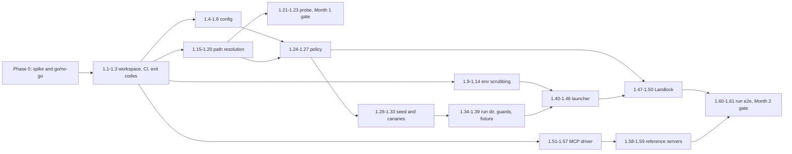

# mcp-gate: TASKS.md

> Atomic, test-first task list for Phase 0 (Week 1 live runner spike) and Phase 1 (Months 1 and 2: core runner and canaries).
> Source of truth: [SPEC.md](SPEC.md) v0.2 (approved). If a task and the spec disagree, fix the spec first.

| Field | Value |
|---|---|
| Covers | Phase 0 (Week 1), Phase 1 (Weeks 2 to 8) |
| Task count | 13 in Phase 0, 61 in Phase 1 |
| Out of scope here | seccomp BPF builder and notification loop, inotify tripwire, leak scanner, evaluator, SARIF and JUnit writers, probes, GitHub Action (Months 3 to 6) |

A naming note before anything else. "Phase 0" and "Phase 1" in this file are *implementation* phases, as you asked. Test IDs such as `P1-ENV-01` or `P2-LAUNCH-04` keep their SPEC meaning (P1 = unit tests, P2 = Linux integration tests). That is why some P2 tests show up in Phase 1: SPEC section 5 schedules them for Month 2.

---

## 0. How to work through this file

### 0.1 The loop for every task

1. Write the red test exactly as named. Run it. Watch it fail for the right reason (missing symbol or wrong value, not a typo).
2. Write the smallest implementation that turns it green.
3. Refactor while green.
4. Run the task's done command and the global checks in 0.4.
5. Tick the box in the tracker (section 0.6) and commit as `TASK-x.y: <title>`. Paste the red failure line into the commit body as `RED: ...`.

One task per commit. If a task grows past roughly half a day, split it and add the new IDs with a letter suffix (`TASK-1.17a`).

### 0.2 Where commands run

| Tag | Meaning |
|---|---|
| `[any]` | Runs on macOS and Linux. Use it directly on the laptop. |
| `[linux]` | Needs a Linux kernel. Run inside the Lima VM (`L <cmd>`, see below) or let CI run it. |
| `[ci]` | Needs a pushed branch and GitHub-hosted runners. Uses the helper scripts from TASK-0.2. |

One-time Lima setup on the Mac (Ubuntu 24.04, close to the runner image, but not identical; the spike in CI is the real proof):

```bash
limactl start --name mcpg --mount-writable template://ubuntu-24.04
limactl shell mcpg -- bash -lc 'sudo apt-get update && sudo apt-get install -y build-essential jq python3 && curl --proto =https --tlsv1.2 -sSf https://sh.rustup.rs | sh -s -- -y'
alias L='limactl shell --workdir "$PWD" mcpg -- bash -lc'
```

If your Lima version lacks `--mount-writable`, set `mounts[].writable: true` in the instance YAML instead. `[ci]` tasks need the GitHub CLI (`gh auth status` should succeed).

### 0.3 Test naming

Tests that implement a SPEC test ID start with that ID in snake case: `P1-ENV-01` becomes `fn p1_env_01_<description>()`. Extra tests not listed in SPEC get descriptive names. Done commands use libtest's multiple-filter form, so the expected pass count is exact:

```bash
cargo test -p mcpg-domain --test env_scrub -- p1_env_01 p1_env_02 p1_env_03
# expect: test result: ok. 3 passed; 0 failed
```

Linux-only test files start with `#![cfg(target_os = "linux")]`, so on macOS they compile to zero tests instead of failing.

### 0.4 Global definition of done (applies to every task)

Every task's done criteria implicitly include these, all exiting 0:

```bash
cargo fmt --all --check
cargo clippy --workspace --all-targets -- -D warnings
scripts/check-test-ids.sh <SPEC test IDs listed in the task>   # from TASK-1.2 onward
```

From TASK-1.2 on, CI also enforces line coverage of 80 percent or more on the workspace (spikes and fixtures excluded). Functions in `mcpg-domain` aim for cyclomatic complexity of 3 or less (SPEC 3.0).

### 0.5 Spec gaps found while planning

These do not block work, but they should land in SPEC v0.3 before the affected task starts (spec first, per SPEC "How to read this document").

1. **`resolve()` needs a root.** P1-PATH-11 expects `escaped_via = none` for `../f` from `dirfd=/c/ws/sub` because the result stays inside the workspace. The SPEC 3.3.5 signature has no root parameter to judge that. TASK-1.17 adds `root: &Path`. Amend SPEC 3.3.5 first.
2. **Sections without REQ IDs.** The run directory (3.1.2), launch sequence (3.1.4), Landlock mapping (3.1.5), shutdown (3.1.6), canary catalogue (3.2.2) and MCP driver (3.5) have normative text but no `REQ-*` IDs. Tasks below cite the section number (for example `§3.1.4`). Proposal for v0.3: add `REQ-RUNDIR-*`, `REQ-LAUNCH-*`, `REQ-LL-*`, `REQ-SHUT-*`, `REQ-CANCAT-*`, `REQ-MCP-*` and re-point these tasks.
3. **P1-CAN-06 and P1-SEED-03 in Month 2.** SPEC lists them as Month 2 done criteria, but SARIF and JUnit writers arrive in Month 4. TASK-1.38 writes both tests against a writer registry, so the Month 4 writers are covered automatically when they register.

### 0.6 Tracker

| ID | Title | Week | Done |
|---|---|---|---|
| TASK-0.1 | Spike crate and report envelope | 1 | [x] |
| TASK-0.2 | Spike workflow and CI helper scripts | 1 | [x] |
| TASK-0.3 | P0-SPIKE-01 seccomp listener fd | 1 | [x] |
| TASK-0.4 | P0-SPIKE-02 receive and continue | 1 | [x] |
| TASK-0.5 | P0-SPIKE-03 read path from child memory | 1 | [x] |
| TASK-0.6 | P0-SPIKE-04 WAIT_KILLABLE_RECV probe | 1 | [x] |
| TASK-0.7 | P0-SPIKE-05 Landlock ABI and restrict | 1 | [x] |
| TASK-0.8 | P0-SPIKE-06 Landlock plus seccomp in one child | 1 | [x] |
| TASK-0.9 | P0-SPIKE-07 inotify on child reads | 1 | [x] |
| TASK-0.10 | P0-SPIKE-08 inotify on mmap read | 1 | [x] |
| TASK-0.11 | P0-SPIKE-09 non-dumpable parent | 1 | [x] |
| TASK-0.12 | P0-SPIKE-10 notification overhead | 1 | [x] |
| TASK-0.13 | Compat report and go/no-go | 1 | [x] |
| TASK-1.1 | Cargo workspace scaffold | 2 | [x] |
| TASK-1.2 | CI pipeline and traceability script | 2 | [ ] |
| TASK-1.3 | Exit codes and precedence | 2 | [ ] |
| TASK-1.4 | YAML parser ADR and config model | 2 | [ ] |
| TASK-1.5 | JSON Schema validation | 2 | [ ] |
| TASK-1.6 | YAML span map | 3 | [ ] |
| TASK-1.7 | Path variable expansion | 3 | [ ] |
| TASK-1.8 | `mcp-gate validate` | 3 | [ ] |
| TASK-1.9 | Env: fixed vars and exact passthrough | 3 | [ ] |
| TASK-1.10 | Env: wildcard, set, decoys | 3 | [ ] |
| TASK-1.11 | Env: CI deny list | 3 | [ ] |
| TASK-1.12 | Env: secret-shaped names | 3 | [ ] |
| TASK-1.13 | Env: reserved names | 3 | [ ] |
| TASK-1.14 | Env: byte exactness and ordering | 3 | [ ] |
| TASK-1.15 | `FsView` port and in-memory fake | 4 | [ ] |
| TASK-1.16 | `is_within` containment | 4 | [ ] |
| TASK-1.17 | `resolve`: lexical cases | 4 | [ ] |
| TASK-1.18 | `resolve`: symlinks | 4 | [ ] |
| TASK-1.19 | `resolve`: missing tails and raw bytes | 4 | [ ] |
| TASK-1.20 | `resolve`: /proc and /dev/fd | 4 | [ ] |
| TASK-1.21 | Host capability model | 4 | [ ] |
| TASK-1.22 | `mcp-gate probe` on Linux, exit 69 elsewhere | 4 | [ ] |
| TASK-1.23 | Month 1 milestone gate | 4 | [ ] |
| TASK-1.24 | Policy: canonical entries | 5 | [ ] |
| TASK-1.25 | Policy: write implies read, child binaries | 5 | [ ] |
| TASK-1.26 | Policy: baselines and capsule tmp | 5 | [ ] |
| TASK-1.27 | Policy: enforcement vs evaluation sets | 5 | [ ] |
| TASK-1.28 | Seed type and entropy port | 5 | [ ] |
| TASK-1.29 | HKDF key derivation | 5 | [ ] |
| TASK-1.30 | Canary catalogue, AWS and env kinds | 5 | [ ] |
| TASK-1.31 | Remaining file canary kinds | 6 | [ ] |
| TASK-1.32 | Deterministic SSH ed25519 canary | 6 | [ ] |
| TASK-1.33 | Canary planter and registry | 6 | [ ] |
| TASK-1.34 | Runner self-hardening (non-dumpable) | 6 | [ ] |
| TASK-1.35 | Run directory | 6 | [ ] |
| TASK-1.36 | Workspace copy and link fixture | 6 | [ ] |
| TASK-1.37 | Checkout credential hint | 6 | [ ] |
| TASK-1.38 | Report writer registry and guards | 6 | [ ] |
| TASK-1.39 | syscall-probe fixture skeleton | 6 | [ ] |
| TASK-1.40 | Capsule plan builder | 7 | [ ] |
| TASK-1.41 | Spawn with pre_exec hardening | 7 | [ ] |
| TASK-1.42 | Scrubbed env reaches the capsule | 7 | [ ] |
| TASK-1.43 | Capsule cannot read runner environ | 7 | [ ] |
| TASK-1.44 | Parent-death signal | 7 | [ ] |
| TASK-1.45 | Subreaper and shutdown sequence | 7 | [ ] |
| TASK-1.46 | Panic guard | 7 | [ ] |
| TASK-1.47 | Landlock rule plan (pure) | 7 | [ ] |
| TASK-1.48 | ELF interpreter and shebang discovery | 7 | [ ] |
| TASK-1.49 | Apply Landlock in the child | 7 | [ ] |
| TASK-1.50 | Landlock fallback and `--require` | 7 | [ ] |
| TASK-1.51 | JSON-RPC stdio framing | 8 | [ ] |
| TASK-1.52 | MCP handshake | 8 | [ ] |
| TASK-1.53 | `tools/list` pagination | 8 | [ ] |
| TASK-1.54 | `tools/call` and scenario expectations | 8 | [ ] |
| TASK-1.55 | Server-to-client requests | 8 | [ ] |
| TASK-1.56 | Timeouts | 8 | [ ] |
| TASK-1.57 | Phase cursor | 8 | [ ] |
| TASK-1.58 | Benign reference server | 8 | [ ] |
| TASK-1.59 | Vulnerable reference server | 8 | [ ] |
| TASK-1.60 | `mcp-gate run` end to end, no observer | 8 | [ ] |
| TASK-1.61 | Month 2 milestone gate | 8 | [ ] |



---

## Phase 0: hosted-runner spike (Week 1)

The spike answers one question before product code exists: do seccomp user notifications, Landlock and inotify work for an unprivileged user on GitHub-hosted runners? SPEC 4.1.1 defines the checks and the go/no-go gate.

Spike rules:
- It lives in `spikes/runner-probe/`, a standalone crate that is **not** a workspace member. One `main.rs`, raw `libc` calls, no abstractions. Deleted in Month 3 once `mcp-gate probe` and the P2-OBS tests cover the same ground.
- The binary is single-threaded. Tests call the binary through `std::process::Command` and parse its JSON. They never `fork` inside the multi-threaded test harness.
- If the `libc` crate lacks a seccomp struct or ioctl number (`seccomp_notif`, `seccomp_notif_resp`, `SECCOMP_IOCTL_NOTIF_RECV` and friends), define it locally with `#[repr(C)]` and a comment pointing at `linux/seccomp.h`.
- Every check writes `{"status": "pass"|"fail"|"info", "detail": {...}}` under `checks["P0-SPIKE-NN"]`. A check that is not written yet reports `"status": "not_implemented"`.

### TASK-0.1: Spike crate and report envelope

Get a binary that prints a host report with no checks yet.

| Field | Detail |
|---|---|
| Requirements | REQ-OBS-010 (coverage is recorded) |
| Red test | `spikes/runner-probe/tests/spike.rs`: `p0_envelope_has_host_fields`. Runs `runner-probe --check none --json`, asserts `schema == "runner-probe/v1"`, non-empty `kernel` (from `uname -r`), `arch`, and an empty `checks` object |
| Implementation | `spikes/runner-probe/Cargo.toml` (deps: `libc`, `serde_json`), `spikes/runner-probe/src/main.rs`: argument parsing for `--check <ID\|all\|none>`, `--json`, `--iterations <N>`; envelope output |
| Done | `[linux] L 'cargo test --manifest-path spikes/runner-probe/Cargo.toml --test spike -- p0_envelope'` exits 0 with `1 passed; 0 failed` |

### TASK-0.2: Spike workflow and CI helper scripts

Put the spike on live runners now, so every following check is proven on GitHub the same day it is written. The workflow is expected to be red until the gating checks exist.

| Field | Detail |
|---|---|
| Requirements | REQ-OBS-001 (feasibility on target runners) |
| Red test | `scripts/tests/spike_result_test.sh`: runs `scripts/spike-result.sh --file scripts/tests/fixtures/probe-pass.json P0-SPIKE-01` (expect stdout `pass`, exit 0), the same against `probe-fail.json` (expect `fail`, exit 1), an `info` fixture (expect `info: ...`, exit 0) and a `not_implemented` fixture (expect exit 1). Prints `ok 4/4` |
| Implementation | `scripts/spike-result.sh <CHECK> <runner>` or `--file <json> <CHECK>`: reads `artifacts/spike/probe-<runner>/probe.json`. `scripts/ci-wait.sh <workflow.yml>`: finds the run for the current HEAD SHA, waits with `gh run watch`, downloads all artifacts into `artifacts/<workflow-name>/`, exits 0 only if the run succeeded. `.github/workflows/spike.yml`: matrix `ubuntu-latest`, `ubuntu-22.04`, `ubuntu-24.04-arm`; builds the spike in release mode; runs `runner-probe --check all --json > probe.json`; uploads `probe-${{ matrix.os }}` with `if: always()`; a final step fails the job unless P0-SPIKE-01, 02, 03 and 07 report `pass` |
| Done | `[any] bash scripts/tests/spike_result_test.sh` exits 0 with `ok 4/4`. `[ci] git push && scripts/ci-wait.sh spike.yml` exits **1** at this point, and `scripts/spike-result.sh P0-SPIKE-01 ubuntu-latest` prints `not_implemented`. That red CI run is the expected result |

### TASK-0.3: P0-SPIKE-01, seccomp listener fd

| Field | Detail |
|---|---|
| Requirements | REQ-OBS-001 |
| Red test | `spikes/runner-probe/tests/spike.rs`: `p0_spike_01_listener_fd_received`. Runs `--check P0-SPIKE-01 --json`, asserts status `pass` and `detail.listener_fd >= 3` |
| Implementation | `main.rs::check_listener()`: `socketpair(AF_UNIX, SOCK_SEQPACKET)`, `fork`. Child: `prctl(PR_SET_NO_NEW_PRIVS, 1)`, install a hand-written BPF filter (load arch, kill on mismatch; `openat` returns `SECCOMP_RET_USER_NOTIF`; everything else `ALLOW`) with `SECCOMP_FILTER_FLAG_NEW_LISTENER`, `sendmsg` the fd with `SCM_RIGHTS`, `_exit(0)`. Parent: `recvmsg`, record fd, `waitpid` |
| Done | `[linux] L 'cargo test --manifest-path spikes/runner-probe/Cargo.toml --test spike -- p0_spike_01'` exits 0, `1 passed`. `[ci] scripts/ci-wait.sh spike.yml; scripts/spike-result.sh P0-SPIKE-01 ubuntu-latest` prints `pass` and the second command exits 0 |

### TASK-0.4: P0-SPIKE-02, receive a notification and continue

| Field | Detail |
|---|---|
| Requirements | REQ-OBS-001 |
| Red test | `spike.rs`: `p0_spike_02_notification_continue`. Asserts status `pass`, `detail.notifications == 1`, `detail.child_open_ok == true` |
| Implementation | `main.rs::check_continue()`: after the handover from TASK-0.3, the child calls `openat(AT_FDCWD, "/etc/hostname", O_RDONLY)` and exits 0 only if it got an fd. The parent loops `SECCOMP_IOCTL_NOTIF_RECV` with a 2 s `poll` timeout and answers with `SECCOMP_USER_NOTIF_FLAG_CONTINUE` |
| Done | `L 'cargo test --manifest-path spikes/runner-probe/Cargo.toml --test spike -- p0_spike_02'` exits 0, `1 passed`. `[ci] scripts/spike-result.sh P0-SPIKE-02 ubuntu-latest` prints `pass` |

### TASK-0.5: P0-SPIKE-03, read the path from child memory

| Field | Detail |
|---|---|
| Requirements | REQ-OBS-001 |
| Red test | `spike.rs`: `p0_spike_03_path_read_from_proc_mem`. Asserts status `pass` and `detail.path == "/etc/hostname"`, `detail.id_valid == true` |
| Implementation | `main.rs::read_path()`: open `/proc/<pid>/mem`, `pread` up to `PATH_MAX` at `data.args[1]`, stop at NUL, then `SECCOMP_IOCTL_NOTIF_ID_VALID` before trusting the bytes |
| Done | `L 'cargo test --manifest-path spikes/runner-probe/Cargo.toml --test spike -- p0_spike_03'` exits 0, `1 passed`. `[ci] scripts/spike-result.sh P0-SPIKE-03 ubuntu-latest` prints `pass` |

### TASK-0.6: P0-SPIKE-04, WAIT_KILLABLE_RECV probe

Informational. Records whether the kernel accepts the flag that tames Go's `SIGURG` re-notifications (SPEC 3.3.4).

| Field | Detail |
|---|---|
| Requirements | REQ-OBS-010 |
| Red test | `spike.rs`: `p0_spike_04_wait_killable_recorded`. Asserts status is `pass` or `info` and `detail.wait_killable_recv` is a boolean |
| Implementation | `main.rs::check_wait_killable()`: install with `NEW_LISTENER \| WAIT_KILLABLE_RECV` (value `1 << 5`); on `EINVAL`, retry without and record `false` |
| Done | `L 'cargo test --manifest-path spikes/runner-probe/Cargo.toml --test spike -- p0_spike_04'` exits 0, `1 passed`. `[ci] scripts/spike-result.sh P0-SPIKE-04 ubuntu-latest` prints `pass` or `info: wait_killable_recv=false`, exit 0 |

### TASK-0.7: P0-SPIKE-05, Landlock ABI and restriction

Not gating. A failure here moves Landlock to "where available".

| Field | Detail |
|---|---|
| Requirements | REQ-OBS-010; §3.1.5 |
| Red test | `spike.rs`: `p0_spike_05_landlock_restricts`. Asserts `detail.abi` is an integer, and when `abi >= 1`: status `pass`, `detail.inside_read_ok == true`, `detail.outside_errno == "EACCES"`. When `abi == 0` (unsupported): status `fail` with a reason |
| Implementation | `main.rs::check_landlock()`: `landlock_create_ruleset(NULL, 0, LANDLOCK_CREATE_RULESET_VERSION)`; build a ruleset handling `READ_FILE \| READ_DIR`, add a `path_beneath` rule for a fresh temp dir; child sets `no_new_privs`, calls `landlock_restrict_self`, reads a file in the temp dir and `/etc/hostname` |
| Done | `L 'cargo test --manifest-path spikes/runner-probe/Cargo.toml --test spike -- p0_spike_05'` exits 0, `1 passed`. `[ci] scripts/spike-result.sh P0-SPIKE-05 ubuntu-latest` prints `pass` (expected) or `fail` (then follow the gate in TASK-0.13) |

### TASK-0.8: P0-SPIKE-06, Landlock plus seccomp plus exec

Proves the SPEC 3.1.4 ordering works in one child.

| Field | Detail |
|---|---|
| Requirements | REQ-OBS-001; §3.1.4, §3.1.5 |
| Red test | `spike.rs`: `p0_spike_06_combined_order`. Asserts status `pass`, `detail.allowed_cat_stdout` equals the allowed file's content, `detail.denied_cat_exit != 0` with `Permission denied` on stderr, and `detail.notified_paths` contains both file paths |
| Implementation | `main.rs::check_combined()`: ruleset with `READ_FILE \| EXECUTE` beneath `/usr`, `/lib`, `/lib64` (if present), `/etc/ld.so.cache`, plus read on an "allowed" temp dir. Child order: `no_new_privs`, `landlock_restrict_self`, seccomp with listener, send fd, `execve("/usr/bin/cat", [allowed_file])`. Second run with the denied file. Parent answers every notification with CONTINUE and logs paths |
| Done | `L 'cargo test --manifest-path spikes/runner-probe/Cargo.toml --test spike -- p0_spike_06'` exits 0, `1 passed`. `[ci] scripts/spike-result.sh P0-SPIKE-06 ubuntu-latest` prints `pass` or `fail` |

### TASK-0.9: P0-SPIKE-07, inotify sees child reads

| Field | Detail |
|---|---|
| Requirements | REQ-OBS-001 (inotify is a required companion) |
| Red test | `spike.rs`: `p0_spike_07_inotify_open_and_access`. Asserts status `pass` and `detail.events` contains `IN_OPEN` and `IN_ACCESS` |
| Implementation | `main.rs::check_inotify()`: `inotify_init1(IN_CLOEXEC)`, watch a temp file with `IN_OPEN \| IN_ACCESS \| IN_CLOSE_NOWRITE`, spawn `/usr/bin/cat <file>`, read events with a 2 s timeout |
| Done | `L 'cargo test --manifest-path spikes/runner-probe/Cargo.toml --test spike -- p0_spike_07'` exits 0, `1 passed`. `[ci] scripts/spike-result.sh P0-SPIKE-07 ubuntu-latest` prints `pass` |

### TASK-0.10: P0-SPIKE-08, inotify on an mmap read

Informational. Confirms the tripwire must key on `IN_OPEN`, not `IN_ACCESS`.

| Field | Detail |
|---|---|
| Requirements | REQ-OBS-010 |
| Red test | `spike.rs`: `p0_spike_08_mmap_read_events`. Asserts `detail.events` contains `IN_OPEN`; status `pass` if so; `detail.in_access_seen` recorded as a boolean, not asserted |
| Implementation | `main.rs::check_mmap()`: child opens the file, `mmap(PROT_READ, MAP_PRIVATE)`, reads one byte, exits |
| Done | `L 'cargo test --manifest-path spikes/runner-probe/Cargo.toml --test spike -- p0_spike_08'` exits 0, `1 passed`. `[ci] scripts/spike-result.sh P0-SPIKE-08 ubuntu-latest` prints `pass` |

### TASK-0.11: P0-SPIKE-09, non-dumpable parent hides its environment

| Field | Detail |
|---|---|
| Requirements | REQ-PROC-001 |
| Red test | `spike.rs`: `p0_spike_09_dumpable_zero_hides_environ`. Runs the binary with `MCPG_SPIKE_SECRET=s3` in its environment; asserts status `pass`, `detail.errno == "EACCES"`, `detail.secret_seen == false` |
| Implementation | `main.rs::check_dumpable()`: `prctl(PR_SET_DUMPABLE, 0)`, then spawn `/usr/bin/cat /proc/<ppid>/environ` (pid passed as an argument), capture exit status and output |
| Done | `L 'cargo test --manifest-path spikes/runner-probe/Cargo.toml --test spike -- p0_spike_09'` exits 0, `1 passed`. `[ci] scripts/spike-result.sh P0-SPIKE-09 ubuntu-latest` prints `pass` |

### TASK-0.12: P0-SPIKE-10, notification overhead

Informational. Feeds the 3x budget in P3-BEN-11.

| Field | Detail |
|---|---|
| Requirements | REQ-OBS-010 |
| Red test | `spike.rs`: `p0_spike_10_overhead_ratio`. Runs with `--iterations 10000`; asserts status `info` and `detail.ratio` is finite and greater than 0 |
| Implementation | `main.rs::check_overhead()`: child loops `openat("/dev/null")` + `close` N times, once without and once with the notifying filter (parent answering CONTINUE). `ratio = with_ns / without_ns`. Workflow runs it with the default 100,000 |
| Done | `L 'cargo test --manifest-path spikes/runner-probe/Cargo.toml --test spike -- p0_spike_10'` exits 0, `1 passed`. `[ci] scripts/spike-result.sh P0-SPIKE-10 ubuntu-latest` prints `info: ratio=<n>`, exit 0 |

### TASK-0.13: Compat report and go/no-go decision

| Field | Detail |
|---|---|
| Requirements | REQ-OBS-001, REQ-OBS-010, REQ-PROC-001 |
| Red test | `scripts/tests/render_compat_test.sh`: four fixture sets of three `probe.json` files each. All gating pass: `Decision: GO`. P0-SPIKE-05 fails on one runner: `Decision: GO (observe mode on <runner>)`. P0-SPIKE-09 fails: `Decision: GO (REQ-PROC-001 dropped)`. P0-SPIKE-03 fails on `ubuntu-latest`: `Decision: NO-GO`. Prints `ok 4/4` |
| Implementation | `scripts/render-compat.sh <probe.json>...`: Markdown table (runner x check x status/detail) plus one `Decision:` line computed exactly by the SPEC 4.1.1 gate. Output committed as `docs/runner-compat.md` |
| Done | `[any] bash scripts/tests/render_compat_test.sh` exits 0, `ok 4/4`. `[ci] scripts/ci-wait.sh spike.yml` exits 0, then `scripts/render-compat.sh artifacts/spike/*/probe.json > docs/runner-compat.md && grep '^Decision:' docs/runner-compat.md` prints `Decision: GO` (the expected outcome). Any `NO-GO` stops Phase 1 and triggers the re-plan in SPEC 4.1.1 |

---

## Phase 1, Month 1 (Weeks 2 to 4): foundations

### 1A. Workspace, CI, exit codes

#### TASK-1.1: Cargo workspace scaffold

| Field | Detail |
|---|---|
| Requirements | §3.0 (layout, `forbid(unsafe_code)`) |
| Red test | `crates/mcpg-cli/tests/cli_version.rs`: `version_prints_semver_and_protocols`. Runs `mcp-gate version` via `assert_cmd`, expects exit 0 and stdout containing `mcp-gate 0.1.0` and `2025-06-18`. Plus `scripts/tests/forbid_unsafe_test.sh`: every `lib.rs`/`main.rs` under `crates/` except `mcpg-linux` contains `#![forbid(unsafe_code)]` |
| Implementation | Root `Cargo.toml` (workspace, members `crates/*` and `fixtures/servers/syscall-probe` later; `exclude = ["spikes"]`), `rust-toolchain.toml` (pinned stable), `clippy.toml` (`cognitive-complexity-threshold = 3`), six crate skeletons (`mcpg-domain`, `mcpg-app`, `mcpg-linux`, `mcpg-mcp`, `mcpg-report`, `mcpg-cli`), `crates/mcpg-cli/src/main.rs` with a `clap` `version` subcommand; binary name `mcp-gate` |
| Done | `[any] cargo test -p mcpg-cli --test cli_version` exits 0, `1 passed`. `[any] bash scripts/tests/forbid_unsafe_test.sh` exits 0 |

#### TASK-1.2: CI pipeline and traceability script

The red state here is honest but simple: the workflow does not exist yet, so `ci-wait.sh` fails.

| Field | Detail |
|---|---|
| Requirements | §4.7 (CI matrix); SPEC rule "a requirement with no test is a defect" |
| Red test | `scripts/tests/check_test_ids_test.sh`: in a temp dir with a fake `fn p1_env_01_x()`, `scripts/check-test-ids.sh P1-ENV-01` exits 0; `P1-ENV-02` exits 1 and prints `missing: P1-ENV-02`; range form `P1-ENV-01..02` exits 1. Before the workflow exists, `scripts/ci-wait.sh ci.yml` exits non-zero with `no run found` |
| Implementation | `scripts/check-test-ids.sh` (expands `PREFIX-NN..MM`, greps `fn <snake_id>` under `crates/`, `fixtures/`, `spikes/`). `.github/workflows/ci.yml`: job `domain` on `ubuntu-latest` and `macos-latest` (fmt, clippy, `cargo test --workspace`), job `linux-integration` on `ubuntu-24.04` and `ubuntu-22.04` (`cargo test --workspace`), job `coverage` (`cargo llvm-cov --workspace --fail-under-lines 80 --ignore-filename-regex '(spikes\|fixtures)/'`) |
| Done | `[any] bash scripts/tests/check_test_ids_test.sh` exits 0. `[ci] git push && scripts/ci-wait.sh ci.yml` exits 0 |

#### TASK-1.3: Exit codes and precedence

| Field | Detail |
|---|---|
| Requirements | REQ-EXIT-002 (test P1-EXIT-01) |
| Red test | `crates/mcpg-domain/tests/exit_codes.rs`: `p1_exit_01_precedence_table`. Table-driven: e.g. `{Security, Inconclusive} -> 1`, `{Functional, Inconclusive} -> 2`, `{Usage, Security} -> 64`, `{Unsupported, Internal} -> 69`, `{} -> 0` |
| Implementation | `crates/mcpg-domain/src/verdict.rs`: `enum ExitCode { Pass = 0, FailSecurity = 1, FailFunctional = 2, Inconclusive = 3, Usage = 64, UnsupportedHost = 69, Internal = 70 }`, `fn combine(codes: impl IntoIterator<Item = ExitCode>) -> ExitCode` using the order `64 > 69 > 70 > 1 > 2 > 3 > 0` |
| Done | `[any] cargo test -p mcpg-domain --test exit_codes -- p1_exit_01` exits 0, `1 passed` |

### 1B. Configuration

#### TASK-1.4: YAML parser ADR and config model

`serde_yaml` is archived, and the span map (TASK-1.6) needs line numbers, so the parser choice gets a short ADR first.

| Field | Detail |
|---|---|
| Requirements | REQ-CFG-001 (test P1-CFG-01) |
| Red test | `crates/mcpg-app/tests/config_load.rs`: `p1_cfg_01_valid_configs_load`. Iterates `tests/configs/valid/*.yaml` (start with `minimal.yaml` and `annotated.yaml`, the SPEC 2.2 example verbatim) and asserts each parses into `Config` with expected `server.name` |
| Implementation | `docs/adr/0001-yaml-parser.md` (pick a maintained parser that exposes line markers; `saphyr` is the first candidate). `crates/mcpg-domain/src/config/model.rs`: typed structs mirroring SPEC 2.3, `#[serde(deny_unknown_fields)]`. `crates/mcpg-app/src/config/load.rs`: `pub fn load_str(src: &str) -> Result<Config, ConfigError>` (pure, no file I/O) |
| Done | `[any] cargo test -p mcpg-app --test config_load -- p1_cfg_01` exits 0, `1 passed`. `test -f docs/adr/0001-yaml-parser.md` exits 0 |

#### TASK-1.5: JSON Schema validation

| Field | Detail |
|---|---|
| Requirements | REQ-CFG-002, REQ-SEED-001, REQ-POL-001 (tests P1-CFG-02, P1-SEED-02) |
| Red test | `crates/mcpg-app/tests/config_schema.rs`: `p1_cfg_02_invalid_configs_rejected` iterates `tests/configs/invalid/{unknown_key,bad_version,missing_policy,glob_in_path}.yaml`, each must return `ConfigError::Schema` or `ConfigError::Semantic`. `p1_seed_02_seed_key_rejected` loads `invalid/canaries_seed.yaml` and expects a schema error naming `canaries.seed` |
| Implementation | `schema/mcp-gate.config.v1.json` (copied from SPEC 2.3), `crates/mcpg-app/src/config/schema.rs`: validate YAML-as-JSON with the `jsonschema` crate (schema embedded via `include_str!`), then a semantic pass that rejects `*`, `?` or `[` in any path entry (REQ-POL-001, no globs) |
| Done | `[any] cargo test -p mcpg-app --test config_schema -- p1_cfg_02 p1_seed_02` exits 0, `2 passed` |

#### TASK-1.6: YAML span map

| Field | Detail |
|---|---|
| Requirements | REQ-CFG-002 (error names the line); groundwork for REQ-SARIF-001 |
| Red test | `crates/mcpg-app/tests/span_map.rs`: `span_policy_key_line` (`policy` in `annotated.yaml` is line 19), `span_scenario_id_line` (`scenarios[1].id`), `span_unknown_key_error_names_line` (`invalid/unknown_key.yaml` has the bad key on line 7; the error message contains `line 7`) |
| Implementation | `crates/mcpg-app/src/config/spans.rs`: `SpanMap::from_str(&str)`, `fn line_of(&self, path: &str) -> Option<u32>` with dotted paths and `[n]` indices; `ConfigError` carries an optional line |
| Done | `[any] cargo test -p mcpg-app --test span_map` exits 0, `3 passed` |

Line numbers above refer to the fixture files as committed; adjust the expected numbers if you change the fixtures, not the other way round.

#### TASK-1.7: Path variable expansion

| Field | Detail |
|---|---|
| Requirements | §2.2 (test P1-CFG-03) |
| Red test | `crates/mcpg-domain/tests/config_vars.rs`: `p1_cfg_03_var_mid_path_rejected` (`/a/${WORKSPACE}/b` is an error), `expands_workspace_prefix`, `unknown_var_rejected` (`${HOME}` is an error), `no_host_env_interpolation` (`$PATH` stays a literal and is rejected as a non-absolute path) |
| Implementation | `crates/mcpg-domain/src/config/vars.rs`: `pub fn expand(raw: &str, vars: &VarTable) -> Result<PathBuf, VarError>`; `VarTable` holds `WORKSPACE`, `CAPSULE_HOME`, `CAPSULE_TMP`, `CONFIG_DIR` |
| Done | `[any] cargo test -p mcpg-domain --test config_vars` exits 0, `4 passed` |

#### TASK-1.8: `mcp-gate validate`

| Field | Detail |
|---|---|
| Requirements | REQ-CFG-001, REQ-CFG-002, REQ-EXIT-002 |
| Red test | `crates/mcpg-cli/tests/cli_validate.rs`: `validate_valid_exits_0` (stdout `OK: tests/configs/valid/annotated.yaml`), `validate_invalid_exits_64_with_line` (stderr contains `line 7`) |
| Implementation | `crates/mcpg-cli/src/cmd/validate.rs`: read file, `load_str`, schema check, map errors to `ExitCode::Usage` |
| Done | `[any] cargo test -p mcpg-cli --test cli_validate` exits 0, `2 passed`. `[any] cargo run -q --bin mcp-gate -- validate --config tests/configs/invalid/unknown_key.yaml; echo $?` prints `64` |

### 1C. Environment scrubbing

All env tasks extend one pure function in `crates/mcpg-domain/src/env.rs` with the SPEC 3.1.3 signature. Tests live in `crates/mcpg-domain/tests/env_scrub.rs`.

#### TASK-1.9: Fixed variables and exact passthrough

| Field | Detail |
|---|---|
| Requirements | REQ-ENV-001 (tests P1-ENV-01, 02, 03) |
| Red test | `p1_env_01_empty_config_yields_only_fixed_vars` (40 host vars in; out: exactly `HOME`, `LANG`, `PATH`, `TMPDIR`, decoys disabled), `p1_env_02_passthrough_copies_value`, `p1_env_03_absent_passthrough_is_omitted` |
| Implementation | `build_env()` steps 1 and 2 from SPEC 3.1.3 |
| Done | `[any] cargo test -p mcpg-domain --test env_scrub -- p1_env_01 p1_env_02 p1_env_03` exits 0, `3 passed` |

#### TASK-1.10: Wildcard, `set` override, decoy precedence

| Field | Detail |
|---|---|
| Requirements | REQ-ENV-001 (tests P1-ENV-04, 10, 11) |
| Red test | `p1_env_04_trailing_wildcard_prefix_match` (`LC_*` matches `LC_ALL`, `LC_TIME`, not `LCX`), `p1_env_10_set_overrides_passthrough`, `p1_env_11_user_set_name_skips_decoy` |
| Implementation | `build_env()` steps 3 and 4 |
| Done | `[any] cargo test -p mcpg-domain --test env_scrub -- p1_env_04 p1_env_10 p1_env_11` exits 0, `3 passed` |

#### TASK-1.11: CI deny list

| Field | Detail |
|---|---|
| Requirements | REQ-ENV-002 (tests P1-ENV-05, 06) |
| Red test | `p1_env_05_ci_vars_dropped` (`GITHUB_TOKEN`, `CI`, `RUNNER_OS` listed in passthrough, none present in output), `p1_env_06_actions_tokens_forbidden` (`ACTIONS_RUNTIME_TOKEN` returns `EnvError::Forbidden`) |
| Implementation | Deny-list filter and forbidden-name check in `env.rs` |
| Done | `[any] cargo test -p mcpg-domain --test env_scrub -- p1_env_05 p1_env_06` exits 0, `2 passed` |

#### TASK-1.12: Secret-shaped names

| Field | Detail |
|---|---|
| Requirements | REQ-ENV-003 (tests P1-ENV-07, 08) |
| Red test | `p1_env_07_secret_name_needs_opt_in` (`MY_API_KEY` returns `EnvError::SecretNeedsOptIn`), `p1_env_08_opt_in_passes_with_warning` (`allow_secret_passthrough: true` passes the value and returns one warning) |
| Implementation | Name heuristic (`*TOKEN*`, `*SECRET*`, `*PASSWORD*`, `*_KEY`, `AWS_*`) and `EnvOutcome { vars, warnings }` |
| Done | `[any] cargo test -p mcpg-domain --test env_scrub -- p1_env_07 p1_env_08` exits 0, `2 passed` |

#### TASK-1.13: Reserved names

| Field | Detail |
|---|---|
| Requirements | REQ-ENV-004 (test P1-ENV-09) |
| Red test | `p1_env_09_reserved_names_rejected` (`set: {HOME: /root}` and `set: {TMPDIR: /x}` are errors), `path_set_requires_reachable_entries` (with a predicate that rejects `/opt/evil`, `PATH=/usr/bin:/opt/evil` is an error) |
| Implementation | Reserved-name check; `PATH` validated through an `is_reachable: &dyn Fn(&Path) -> bool` argument. The real predicate (EnforcementSet) is wired in TASK-1.27 |
| Done | `[any] cargo test -p mcpg-domain --test env_scrub -- p1_env_09 path_set_requires` exits 0, `2 passed` |

#### TASK-1.14: Byte exactness and ordering

| Field | Detail |
|---|---|
| Requirements | REQ-ENV-005 (tests P1-ENV-12, 13) |
| Red test | `p1_env_12_values_preserved_byte_exact` (values containing `\n`, `=`, byte `0xff` via `OsStr::from_bytes`), `p1_env_13_output_sorted_and_stable` (`proptest`, 100 shuffles of the host env, identical sorted output) |
| Implementation | Sort output by name bytes; never round-trip through `String` |
| Done | `[any] cargo test -p mcpg-domain --test env_scrub -- p1_env_12 p1_env_13` exits 0, `2 passed`. `[any] scripts/check-test-ids.sh P1-ENV-01..13` exits 0 |

### 1D. Path resolution

#### TASK-1.15: `FsView` port and in-memory fake

| Field | Detail |
|---|---|
| Requirements | §3.0 (port traits), groundwork for REQ-PATH-001 |
| Red test | `crates/mcpg-domain/tests/fake_fs.rs`: `fake_lstat_dir_file_symlink`, `fake_readlink_returns_target`, `fake_missing_is_enoent` |
| Implementation | `crates/mcpg-domain/src/fs_view.rs`: `trait FsView { fn lstat(&self, p: &Path) -> io::Result<Meta>; fn readlink(&self, p: &Path) -> io::Result<PathBuf>; }`. `crates/mcpg-domain/src/testing/fake_fs.rs` behind cargo feature `testing`; `mcpg-domain` lists itself as a dev-dependency with that feature |
| Done | `[any] cargo test -p mcpg-domain --features testing --test fake_fs` exits 0, `3 passed` |

#### TASK-1.16: `is_within` containment

| Field | Detail |
|---|---|
| Requirements | REQ-PATH-002 (tests P1-CONT-01 to 05) |
| Red test | `crates/mcpg-domain/tests/containment.rs`: `p1_cont_01_sibling_prefix_is_outside` (`/work/space` vs `/work/spa`), `p1_cont_02_child_is_inside`, `p1_cont_03_equal_is_inside`, `p1_cont_04_root_not_inside_subdir`, `p1_cont_05_everything_inside_root` |
| Implementation | `crates/mcpg-domain/src/path/contain.rs`: `pub fn is_within(path: &Path, root: &Path) -> bool`, component-wise |
| Done | `[any] cargo test -p mcpg-domain --test containment` exits 0, `5 passed` |

#### TASK-1.17: `resolve`, lexical cases

Amend SPEC 3.3.5 first: add `root: &Path` to `resolve()` (gap 1 in section 0.5).

| Field | Detail |
|---|---|
| Requirements | REQ-PATH-001 (tests P1-PATH-01, 02, 03, 04, 09, 11) |
| Red test | `crates/mcpg-domain/tests/path_resolve.rs` using `FakeFs`: `p1_path_01_relative_join`, `p1_path_02_dotdot_escape`, `p1_path_03_absolute_escape`, `p1_path_04_dotdot_clamps_at_root`, `p1_path_09_redundant_separators`, `p1_path_11_dirfd_base_inside_root`. Expected values from the SPEC 4.3 table |
| Implementation | `crates/mcpg-domain/src/path/resolve.rs`: `pub fn resolve(fs: &dyn FsView, root: &Path, base: &Path, raw: &[u8], follow_last: bool) -> Resolution`; `Resolution` and `EscapeKind` as in SPEC 3.3.5 |
| Done | `[any] cargo test -p mcpg-domain --features testing --test path_resolve -- p1_path_01 p1_path_02 p1_path_03 p1_path_04 p1_path_09 p1_path_11` exits 0, `6 passed` |

#### TASK-1.18: `resolve`, symlinks

| Field | Detail |
|---|---|
| Requirements | REQ-PATH-001 (tests P1-PATH-05, 06, 07, 08) |
| Red test | `p1_path_05_symlink_escape`, `p1_path_06_symlink_then_dotdot_kernel_order` (`link/../x` with `link -> /c/home/.ssh` resolves to `/c/home/x`), `p1_path_07_nofollow_last_component`, `p1_path_08_eloop_after_40` |
| Implementation | Component walk with a pending-components stack; symlink counter; `follow_last` respected |
| Done | `[any] cargo test -p mcpg-domain --features testing --test path_resolve -- p1_path_05 p1_path_06 p1_path_07 p1_path_08` exits 0, `4 passed` |

#### TASK-1.19: `resolve`, missing tails and raw bytes

| Field | Detail |
|---|---|
| Requirements | REQ-PATH-001 (tests P1-PATH-10, 15) |
| Red test | `p1_path_10_missing_tail_joined_lexically` (`exists == false`), `p1_path_15_non_utf8_preserved` (display form shows `\xff`) |
| Implementation | Deepest-existing-ancestor logic; `Resolution::display()` with `\xNN` escapes |
| Done | `[any] cargo test -p mcpg-domain --features testing --test path_resolve -- p1_path_10 p1_path_15` exits 0, `2 passed` |

#### TASK-1.20: `resolve`, /proc and /dev/fd

| Field | Detail |
|---|---|
| Requirements | REQ-PATH-001 (tests P1-PATH-12, 13, 14) |
| Red test | `p1_path_12_proc_self_maps_to_capsule`, `p1_path_13_foreign_pid_maps_to_foreign` (`escaped_via == ProcFd`), `p1_path_14_dev_fd_follows_fd_table` |
| Implementation | `crates/mcpg-domain/src/path/proc_map.rs`: `ProcCtx { capsule_pids: BTreeSet<u32>, fds: BTreeMap<(u32, i32), PathBuf> }`; `resolve` gains an optional `&ProcCtx` |
| Done | `[any] cargo test -p mcpg-domain --features testing --test path_resolve -- p1_path_12 p1_path_13 p1_path_14` exits 0, `3 passed`. `[any] scripts/check-test-ids.sh P1-PATH-01..15 P1-CONT-01..05` exits 0 |

### 1E. Host probe and Month 1 gate

#### TASK-1.21: Host capability model

| Field | Detail |
|---|---|
| Requirements | REQ-OBS-001, REQ-OBS-010 |
| Red test | `crates/mcpg-domain/tests/host_caps.rs`: `supported_when_notif_inotify_procmem_present`, `missing_user_notif_is_unsupported` (`missing == ["seccomp.user_notif"]`), `landlock_absent_still_supported`, `require_landlock_unmet_is_unsupported` (`missing == ["landlock"]`) |
| Implementation | `crates/mcpg-domain/src/host.rs`: `HostCaps` struct (fields from SPEC 2.1 probe JSON), `fn assess(&self, require: &[Feature]) -> Assessment { supported, missing }` |
| Done | `[any] cargo test -p mcpg-domain --test host_caps` exits 0, `4 passed` |

#### TASK-1.22: `mcp-gate probe` on Linux, exit 69 elsewhere

Ports the spike's detection code into the product, without the spike's throwaway style.

| Field | Detail |
|---|---|
| Requirements | REQ-OBS-001, REQ-OBS-010; Appendix A (non-Linux `run` exits 69) |
| Red test | `crates/mcpg-linux/tests/probe.rs` (`#![cfg(target_os = "linux")]`): `probe_detects_user_notif`, `probe_proc_mem_readable` (forks a child and reads its memory). `crates/mcpg-cli/tests/cli_probe.rs`: `probe_json_has_spec_keys` (Linux only; keys from SPEC 2.1, exit 0 when supported), `run_on_non_linux_exits_69` (`#[cfg(not(target_os = "linux"))]`) |
| Implementation | `crates/mcpg-linux/src/probe.rs` (returns `HostCaps`), `crates/mcpg-cli/src/cmd/probe.rs`, a `run` subcommand stub that exits 69 on non-Linux and 70 (`not implemented`) on Linux for now. Add a `probe` job to `ci.yml` that uploads `mcp-gate probe` output per runner |
| Done | `[linux] L 'cargo test -p mcpg-linux --test probe'` exits 0, `2 passed`. `[linux] L 'cargo run -q --bin mcp-gate -- probe \| jq -e .supported'` prints `true`, exit 0. `[any] (on macOS) cargo test -p mcpg-cli --test cli_probe -- run_on_non_linux_exits_69` exits 0, `1 passed` |

#### TASK-1.23: Month 1 milestone gate

No new code. Confirms SPEC section 5, Month 1.

| Field | Detail |
|---|---|
| Requirements | All Month 1 requirements above |
| Red test | None new. The gate itself is the check |
| Implementation | None. Fix whatever the gate finds, each fix as its own task with a regression test |
| Done | `[any] scripts/check-test-ids.sh P0-SPIKE-01..10 P1-ENV-01..13 P1-PATH-01..15 P1-CONT-01..05 P1-CFG-01..03 P1-EXIT-01` exits 0. `[any] cargo test --workspace --features mcpg-domain/testing` exits 0. `[ci] git push && scripts/ci-wait.sh ci.yml` exits 0. `docs/runner-compat.md` says `Decision: GO` |

---

## Phase 1, Month 2 (Weeks 5 to 8): capsule and canaries

### 1F. Policy

Policy tests live in `crates/mcpg-domain/tests/policy.rs` and use `FakeFs`.

#### TASK-1.24: Canonical policy entries

| Field | Detail |
|---|---|
| Requirements | REQ-POL-001, REQ-POL-002 |
| Red test | `pol_entries_canonicalized` (an entry reached through a symlink resolves to its real path), `pol_missing_entry_is_error` (`/nope` returns `PolicyError::Missing` and maps to exit 64), `pol_missing_under_workspace_scheduled_for_creation` (`${WORKSPACE}/notes` missing is returned in `to_create`) |
| Implementation | `crates/mcpg-domain/src/policy/resolve.rs`: `ResolvedPolicy::from_config(&PolicyConfig, &VarTable, &dyn FsView) -> Result<ResolvedPolicy, PolicyError>`; entries typed as `File(PathBuf)` or `Dir(PathBuf)` |
| Done | `[any] cargo test -p mcpg-domain --features testing --test policy -- pol_entries pol_missing` exits 0, `3 passed` |

#### TASK-1.25: Write implies read, child binary resolution

| Field | Detail |
|---|---|
| Requirements | REQ-POL-003, REQ-POL-004 (tests P1-POL-01, 02) |
| Red test | `p1_pol_01_write_path_grants_read`, `p1_pol_02_child_binary_name_resolved_via_path` (`git` resolves to the canonical `/usr/bin/git` in `FakeFs`, symlinks followed), `root_command_always_executable` |
| Implementation | `policy/resolve.rs`: read set derivation; `resolve_binary(name, capsule_path, fs)` |
| Done | `[any] cargo test -p mcpg-domain --features testing --test policy -- p1_pol_01 p1_pol_02 root_command` exits 0, `3 passed` |

#### TASK-1.26: Baselines and capsule tmp

| Field | Detail |
|---|---|
| Requirements | REQ-POL-005, REQ-POL-006 (test P1-POL-03) |
| Red test | `p1_pol_03_baseline_python_snapshot` (`insta` snapshot of the expanded `python` baseline), `baseline_none_adds_nothing`, `pol_capsule_tmp_always_rw` |
| Implementation | `crates/mcpg-domain/src/policy/baseline.rs`: static lists for `minimal`, `python`, `node`, `none`; expansion filtered through `FsView` so absent paths (for example `/lib64` on arm64) are dropped |
| Done | `[any] cargo test -p mcpg-domain --features testing --test policy -- p1_pol_03 baseline_none pol_capsule_tmp` exits 0, `3 passed`. `cargo insta test -p mcpg-domain --check` exits 0 |

#### TASK-1.27: Enforcement set vs evaluation set

| Field | Detail |
|---|---|
| Requirements | REQ-POL-007, REQ-ENV-004 (test P1-POL-04) |
| Red test | `p1_pol_04_decoy_zone_enforced_not_evaluated`, `evaluation_set_excludes_capsule_home`, and in `env_scrub.rs`: `env_path_checked_against_enforcement_set` (replaces the TASK-1.13 test predicate with `EnforcementSet::contains`) |
| Implementation | `crates/mcpg-domain/src/policy/sets.rs`: `EnforcementSet`, `EvaluationSet` built from `ResolvedPolicy`, baseline, capsule tmp (rw) and capsule home (ro, enforcement only) |
| Done | `[any] cargo test -p mcpg-domain --features testing --test policy -- p1_pol_04 evaluation_set` exits 0, `2 passed`. `[any] cargo test -p mcpg-domain --test env_scrub -- env_path_checked` exits 0, `1 passed`. `[any] scripts/check-test-ids.sh P1-POL-01..04` exits 0 |

### 1G. Seed and canaries

#### TASK-1.28: Seed type and entropy port

| Field | Detail |
|---|---|
| Requirements | REQ-SEED-001, REQ-SEED-003 (tests P1-SEED-01, 04) |
| Red test | `crates/mcpg-domain/tests/seed.rs`: `p1_seed_01_fresh_seeds_differ` (`FakeEntropy` yielding two different 32-byte blocks gives two different seeds), `p1_seed_04_bad_hex_rejected` (63 chars, 65 chars, non-hex). `crates/mcpg-cli/tests/cli_seed.rs`: `p1_seed_04_cli_bad_seed_exits_64` (`mcp-gate run --config tests/configs/valid/minimal.yaml --seed abc` exits 64 before anything else runs) |
| Implementation | `crates/mcpg-domain/src/seed.rs`: `Seed([u8; 32])`, `FromStr` (exactly 64 lowercase or uppercase hex chars), `Display` (lowercase hex). `crates/mcpg-app/src/ports.rs`: `trait EntropySource`. `crates/mcpg-linux/src/entropy.rs` using `getrandom`. CLI parses `--seed` with `clap` and maps parse errors to 64 |
| Done | `[any] cargo test -p mcpg-domain --test seed -- p1_seed_01 p1_seed_04` exits 0, `2 passed`. `[any] cargo test -p mcpg-cli --test cli_seed` exits 0, `1 passed` |

#### TASK-1.29: HKDF key derivation

| Field | Detail |
|---|---|
| Requirements | REQ-SEED-003; §3.2.4 |
| Red test | `crates/mcpg-domain/tests/canary_gen.rs`: `derive_same_seed_same_bytes`, `derive_different_info_differs`, `derive_known_answer` (fixed seed and info give a committed 32-byte hex vector, so an accidental algorithm change is caught) |
| Implementation | `crates/mcpg-domain/src/canary/derive.rs`: `fn derive(seed: &Seed, kind: &str, field: &str, len: usize) -> Vec<u8>` = HKDF-SHA256 (`hkdf`, `sha2`) with info `mcp-gate/v1/<kind>/<field>`, expanded through `rand_chacha::ChaCha20Rng` for long outputs |
| Done | `[any] cargo test -p mcpg-domain --test canary_gen -- derive_` exits 0, `3 passed` |

#### TASK-1.30: Canary catalogue, AWS and env kinds

| Field | Detail |
|---|---|
| Requirements | §3.2.2 (test P1-CAN-04) |
| Red test | `canary_gen.rs`: `catalogue_matches_spec_table` (kind to relative paths and tier, straight from SPEC 3.2.2), `p1_can_04_aws_shapes` (`^AKIA[A-Z2-7]{16}$`, secret 40 chars of `[A-Za-z0-9/+]`), `env_decoys_cover_five_names` (`AWS_ACCESS_KEY_ID`, `AWS_SECRET_ACCESS_KEY`, `GITHUB_TOKEN`, `OPENAI_API_KEY`, `ANTHROPIC_API_KEY`) |
| Implementation | `crates/mcpg-domain/src/canary/catalogue.rs` (kinds, paths, tiers, modes), `crates/mcpg-domain/src/canary/render.rs`: `fn plan(seed, kinds) -> CanaryPlan { files: Vec<PlannedFile>, env: Vec<(OsString, OsString)>, secrets: Vec<Secret> }`, pure |
| Done | `[any] cargo test -p mcpg-domain --test canary_gen -- catalogue_ p1_can_04 env_decoys` exits 0, `3 passed` |

#### TASK-1.31: Remaining file canary kinds

| Field | Detail |
|---|---|
| Requirements | §3.2.2 (test P1-CAN-02) |
| Red test | `canary_gen.rs`: `gcloud_is_valid_json`, `kube_is_valid_yaml`, `docker_auth_is_base64_user_token`, `hosts_use_invalid_tld` (every hostname in every kind ends in `.invalid`), `no_fixed_marker_strings` (no value contains `mcpg`, `canary`, `MCPG` or `EXAMPLE`), `p1_can_02_different_seeds_all_secrets_differ` (all kinds, pairwise) |
| Implementation | `render.rs`: `gcloud`, `kube`, `docker`, `git_credentials`, `gh_cli`, `netrc`, `npmrc`, `pypirc`, `dotenv` renderers |
| Done | `[any] cargo test -p mcpg-domain --test canary_gen -- gcloud_ kube_ docker_ hosts_ no_fixed p1_can_02` exits 0, `6 passed` |

#### TASK-1.32: Deterministic SSH ed25519 canary

The OpenSSH private key format carries a 32-bit "checkint" pair that tools normally fill randomly. It must come from the seed, or P1-CAN-01 fails. If the chosen crate cannot set it, write the encoder by hand (about 60 lines, format in OpenSSH `PROTOCOL.key`).

| Field | Detail |
|---|---|
| Requirements | §3.2.2 (test P1-CAN-03) |
| Red test | `canary_gen.rs`: `p1_can_03_ssh_pub_derivable` (writes the key to a temp file with mode 0600, runs `ssh-keygen -y -f`, compares with the planned `.pub`; skips with a printed reason if `ssh-keygen` is absent), `ssh_key_byte_identical_for_same_seed`, `ssh_key_differs_for_other_seed` |
| Implementation | `crates/mcpg-domain/src/canary/ssh.rs`: `ed25519-dalek` key from derived 32 bytes, OpenSSH v1 encoding with checkint and comment derived from the seed |
| Done | `[any] cargo test -p mcpg-domain --test canary_gen -- p1_can_03 ssh_key_` exits 0, `3 passed` (on a host with `ssh-keygen`, which both macOS and the Lima VM have) |

#### TASK-1.33: Canary planter and registry

| Field | Detail |
|---|---|
| Requirements | REQ-CAN-005 (registry fingerprints), §3.2.3 (tests P1-CAN-01, 05) |
| Red test | `crates/mcpg-linux/tests/canary_plant.rs` (Unix, runs on macOS too): `p1_can_01_plant_twice_byte_identical` (two temp dirs, same seed, `diff -r` equivalent), `p1_can_05_file_and_dir_modes` (files 0600, dirs 0700), `registry_records_dev_ino_and_fingerprint` (`sha256(value)[..12]` hex), `dotenv_planted_one_level_above_workspace` |
| Implementation | `crates/mcpg-domain/src/canary/registry.rs` (`CanaryRegistry`, `CanaryRecord { id, kind, tier, path, dev, ino, fp, secrets }`), `crates/mcpg-linux/src/canary_plant.rs`: `fn plant(plan: &CanaryPlan, run_dir: &RunDir) -> io::Result<CanaryRegistry>` |
| Done | `[any] cargo test -p mcpg-linux --test canary_plant` exits 0, `4 passed`. `[any] scripts/check-test-ids.sh P1-CAN-01..05` exits 0 |

### 1H. Runner process, run directory, report guards, fixture

#### TASK-1.34: Runner self-hardening

The test process hardens itself, then spawns a child. That is safe here because each `tests/*.rs` file is its own process.

| Field | Detail |
|---|---|
| Requirements | REQ-PROC-001 |
| Red test | `crates/mcpg-linux/tests/self_harden.rs` (Linux): `harden_self_hides_environ_from_children`. No extra env var is needed. The test first reads its own `/proc/self/environ` and checks that it contains `PATH`. It then calls `harden_self()` and runs `/usr/bin/cat /proc/<own pid>/environ` and expects a non-zero exit with `Permission denied` |
| Implementation | `crates/mcpg-linux/src/self_harden.rs`: `pub fn harden_self() -> io::Result<()>` (`prctl(PR_SET_DUMPABLE, 0)`, verify with `PR_GET_DUMPABLE`). Called as the first line of `mcp-gate` `main` on Linux |
| Done | `[linux] L 'cargo test -p mcpg-linux --test self_harden'` exits 0, `1 passed` |

#### TASK-1.35: Run directory

| Field | Detail |
|---|---|
| Requirements | §3.1.2 |
| Red test | `crates/mcpg-linux/tests/rundir.rs` (Unix): `rundir_layout_and_mode_0700` (`home/`, `workspace/`, `tmp/` exist; root mode 0700), `rundir_id_is_16_hex`, `rundir_removed_on_drop`, `rundir_kept_with_keep_flag` |
| Implementation | `crates/mcpg-linux/src/rundir.rs`: `RunDir::create(base: &Path, keep: bool, entropy: &dyn EntropySource) -> io::Result<RunDir>`, `Drop` removes it unless `keep` |
| Done | `[any] cargo test -p mcpg-linux --test rundir` exits 0, `4 passed` |

#### TASK-1.36: Workspace copy and link fixture

| Field | Detail |
|---|---|
| Requirements | REQ-POL-002 (in-place mode), §3.1.2, §3.5.1 (payload 07 fixture) |
| Red test | `crates/mcpg-linux/tests/workspace_copy.rs` (Unix): `copy_excludes_git_by_default`, `copy_honours_extra_excludes`, `copy_preserves_symlinks_without_following` (a symlink to `/etc` stays a symlink), `in_place_mode_points_at_source`, `plants_mcpg_link_to_capsule_ssh` |
| Implementation | `crates/mcpg-linux/src/workspace.rs`: `fn prepare(cfg: &WorkspaceConfig, run_dir: &RunDir) -> io::Result<PathBuf>`; copies with `lstat` and `symlink`, never `std::fs::copy` on symlinks |
| Done | `[any] cargo test -p mcpg-linux --test workspace_copy` exits 0, `5 passed` |

#### TASK-1.37: Checkout credential hint

| Field | Detail |
|---|---|
| Requirements | REQ-CI-002 (test P2-LAUNCH-06) |
| Red test | `crates/mcpg-app/tests/cred_hint.rs`: `p2_launch_06_extraheader_warns` (fixture `.git/config` with `extraheader = AUTHORIZATION: basic ...` yields one warning mentioning `persist-credentials: false`; the TASK-1.36 copy has no `.git`), `no_git_dir_no_warning`, `git_without_extraheader_no_warning` |
| Implementation | `crates/mcpg-app/src/hygiene.rs`: `fn checkout_hint(git_config: Option<&str>) -> Option<Warning>` (pure), plus the call site that reads `<source>/.git/config` |
| Done | `[any] cargo test -p mcpg-app --test cred_hint` exits 0, `3 passed` |

#### TASK-1.38: Report writer registry and guards

Minimal console summary and evidence header now. SARIF and JUnit writers join the registry in Month 4 and inherit these tests without edits.

| Field | Detail |
|---|---|
| Requirements | REQ-CAN-005, REQ-SEED-002, REQ-CLAIM-001 (tests P1-CAN-06, P1-SEED-03) |
| Red test | `crates/mcpg-report/tests/report_guard.rs`: builds a `RunRecord` with a registry of real planted values, then for every writer in `mcpg_report::all_writers()`: `p1_can_06_no_raw_canary_in_any_writer`, `p1_seed_03_seed_in_every_writer` (same 64-hex seed everywhere; console line matches `^mcp-gate: seed [0-9a-f]{64} \(replay with --seed [0-9a-f]{64}\)$`), `claim_sentence_in_every_writer` (the REQ-CLAIM-001 sentence verbatim) |
| Implementation | `crates/mcpg-report/src/lib.rs` (`trait ReportWriter`, `fn all_writers()`), `crates/mcpg-report/src/console.rs`, `crates/mcpg-report/src/evidence.rs` (header and footer lines only) |
| Done | `[any] cargo test -p mcpg-report --test report_guard` exits 0, `3 passed` |

#### TASK-1.39: syscall-probe fixture skeleton

The launcher tests need a tiny, predictable child. SPEC 4.2.3 adds the observer subcommands in Month 3; the launcher ones come first.

| Field | Detail |
|---|---|
| Requirements | §4.2.3 |
| Red test | `fixtures/servers/syscall-probe/tests/probe_cli.rs`: one test per subcommand, each asserting one JSON line on stdout: `env` (keys), `fds` (open fd numbers from `/proc/self/fd`, Linux only), `cwd`, `ids` (`pid`, `pgid`, `sid`, `NoNewPrivs` from `/proc/self/status`, `umask`), `read <path>` (`ok` or errno name), `exec <path> [args]` (errno name on failure), `sleep <s>`, `wait-stdin-eof`, `ignore-sigterm`, `daemon` (double fork plus `setsid`, prints grandchild pid) |
| Implementation | `fixtures/servers/syscall-probe/Cargo.toml` (`publish = false`, workspace member), `src/main.rs` |
| Done | `[linux] L 'cargo test -p syscall-probe'` exits 0, `10 passed` |

### 1I. Launcher

Linux launcher tests live in `crates/mcpg-linux/tests/launcher.rs` with `#![cfg(target_os = "linux")]` and run `syscall-probe` as the capsule (`env!("CARGO_BIN_EXE_syscall-probe")` is not visible across packages, so tests locate it under `target/<profile>/`).

#### TASK-1.40: Capsule plan builder

| Field | Detail |
|---|---|
| Requirements | REQ-ENV-005; §3.1.4 (before fork, steps 4 and 5) |
| Red test | `crates/mcpg-app/tests/capsule_plan.rs`: `plan_envp_is_build_env_output_in_order`, `plan_argv_has_vars_expanded`, `plan_cwd_is_prepared_workspace`, `plan_rejects_interior_nul` (`\0` in an arg is a config error, exit 64) |
| Implementation | `crates/mcpg-app/src/capsule_plan.rs`: `CapsulePlan { program: CString, argv: Vec<CString>, envp: Vec<CString>, cwd: PathBuf, mode: Mode }`, built from `Config`, `EnvOutcome`, `VarTable` |
| Done | `[any] cargo test -p mcpg-app --test capsule_plan` exits 0, `4 passed` |

#### TASK-1.41: Spawn with pre_exec hardening

Leave a no-op `SeccompStep` seam between steps 6 and 8; Month 3 fills it.

| Field | Detail |
|---|---|
| Requirements | §3.1.4 (in the child, steps 1, 3, 4, 5) (tests P2-LAUNCH-02, 03) |
| Red test | `launcher.rs`: `p2_launch_02_only_stdio_fds` (probe `fds` returns `[0,1,2]` even though the test opens extra fds without CLOEXEC first), `p2_launch_03_cwd_is_workspace`, `capsule_is_session_and_group_leader` (`pid == pgid == sid`), `no_new_privs_is_set`, `umask_is_077` |
| Implementation | `crates/mcpg-linux/src/launcher.rs`: `impl CapsuleLauncher for LinuxLauncher`; `std::process::Command` with `env_clear`, piped stdio, and a `pre_exec` closure that only calls `libc::setsid`, `close_range`, `chdir` (pre-built `CString`), `umask`, `setrlimit(RLIMIT_CORE, 0)`, `prctl(PR_SET_NO_NEW_PRIVS)`. No allocation inside the closure |
| Done | `[linux] L 'cargo test -p mcpg-linux --test launcher -- p2_launch_02 p2_launch_03 capsule_is_session no_new_privs umask_is'` exits 0, `5 passed` |

#### TASK-1.42: Scrubbed env reaches the capsule

| Field | Detail |
|---|---|
| Requirements | REQ-ENV-001 (test P2-LAUNCH-01) |
| Red test | `launcher.rs`: `p2_launch_01_environ_only_expected_keys`. The test sets `MCPG_HOST_SECRET` and `GITHUB_TOKEN` in its own process env before launching; probe `env` must return exactly the planned keys (fixed, decoys, declared) |
| Implementation | Launcher passes `CapsulePlan.envp` only; assertion helper compares key sets |
| Done | `[linux] L 'cargo test -p mcpg-linux --test launcher -- p2_launch_01'` exits 0, `1 passed` |

#### TASK-1.43: Capsule cannot read the runner's environ

| Field | Detail |
|---|---|
| Requirements | REQ-PROC-001 (test P2-LAUNCH-04) |
| Red test | `launcher.rs`: `p2_launch_04_capsule_cannot_read_runner_environ`. Runs as a re-exec helper (see TASK-1.44 pattern) so the hardened process is the capsule's parent; probe `read /proc/<ppid>/environ` returns `EACCES` |
| Implementation | `LinuxLauncher::launch` asserts `PR_GET_DUMPABLE == 0` before spawning and returns `LaunchError::NotHardened` otherwise |
| Done | `[linux] L 'cargo test -p mcpg-linux --test launcher -- p2_launch_04'` exits 0, `1 passed` |

#### TASK-1.44: Parent-death signal

Test pattern: the test re-executes its own binary (`std::env::current_exe()`) with `MCPG_HELPER=runner` and the filter of an `#[ignore]` helper test. The helper acts as a runner, launches the capsule and prints the capsule pid. The real test then `SIGKILL`s the helper.

| Field | Detail |
|---|---|
| Requirements | §3.1.4 (child step 2), §3.1.6 (test P2-LAUNCH-05) |
| Red test | `launcher.rs`: `p2_launch_05_capsule_dies_with_runner` (after killing the helper, `kill(capsule_pid, 0)` returns `ESRCH` within 1 s), `helper_runner` (`#[ignore]`, only active with `MCPG_HELPER=runner`) |
| Implementation | `pre_exec`: `prctl(PR_SET_PDEATHSIG, SIGKILL)`, then compare `getppid()` with the runner pid captured before spawn and `_exit(127)` on mismatch |
| Done | `[linux] L 'cargo test -p mcpg-linux --test launcher -- p2_launch_05'` exits 0, `1 passed`. `[any] scripts/check-test-ids.sh P2-LAUNCH-01..05` exits 0 |

#### TASK-1.45: Subreaper and shutdown sequence

Before seccomp exists, the process tree comes from `/proc/<pid>/task/*/children` (present on Ubuntu kernels) plus orphans that reparent to the subreaper.

| Field | Detail |
|---|---|
| Requirements | §3.1.4 (subreaper), §3.1.6 |
| Red test | `crates/mcpg-linux/tests/shutdown.rs` (Linux): `stdin_close_ends_cooperative_capsule` (probe `wait-stdin-eof`, exits inside the grace period, `ShutdownReport.stage == StdinClosed`), `stubborn_capsule_gets_sigkill` (probe `ignore-sigterm`, `stage == Killed`), `daemonized_grandchild_reaped_and_reported` (probe `daemon`; afterwards the grandchild pid is gone and listed in `ShutdownReport.survivors`), `no_children_left` (`waitpid(-1, WNOHANG)` returns `ECHILD`) |
| Implementation | `crates/mcpg-linux/src/shutdown.rs`: `fn shutdown(cap: RunningCapsule, grace: Duration) -> ShutdownReport`; `prctl(PR_SET_CHILD_SUBREAPER, 1)` set once in `LinuxLauncher::new` |
| Done | `[linux] L 'cargo test -p mcpg-linux --test shutdown'` exits 0, `4 passed` |

#### TASK-1.46: Panic guard

`panic = "abort"` would skip `Drop`, so the guard uses a panic hook as well as `Drop`.

| Field | Detail |
|---|---|
| Requirements | §3.1.6 (last paragraph) |
| Red test | `shutdown.rs`: `panic_in_runner_kills_capsule` (re-exec helper launches a capsule, prints its pid, then panics; the capsule is gone within 1 s), `guard_drop_kills_capsule` |
| Implementation | `crates/mcpg-linux/src/guard.rs`: `CapsuleGuard` holding the pgid and known pids; `Drop` and a `std::panic::set_hook` wrapper both send `SIGKILL` |
| Done | `[linux] L 'cargo test -p mcpg-linux --test shutdown -- panic_in_runner guard_drop'` exits 0, `2 passed` |

### 1J. Landlock

#### TASK-1.47: Landlock rule plan (pure)

| Field | Detail |
|---|---|
| Requirements | REQ-POL-006, REQ-POL-007; §3.1.5 |
| Red test | `crates/mcpg-domain/tests/landlock_plan.rs`: `read_entries_get_read_rights`, `write_entries_add_write_rights`, `truncate_only_from_abi3`, `decoy_zone_is_read_only`, `dev_nodes_get_ioctl_dev_from_abi5`, `net_rules_when_network_denied_from_abi4`, `scopes_from_abi6`, `observe_mode_has_no_fs_or_exec_rules` |
| Implementation | `crates/mcpg-domain/src/landlock_plan.rs`: own `Access` bitflags (no `landlock` crate dependency in the domain), `fn plan(sets: &EnforcementSet, exec: &[PathBuf], abi: u8, mode: Mode, allow_network: bool) -> LandlockPlan` |
| Done | `[any] cargo test -p mcpg-domain --test landlock_plan` exits 0, `8 passed` |

#### TASK-1.48: ELF interpreter and shebang discovery

| Field | Detail |
|---|---|
| Requirements | §3.1.5 (execute entries) |
| Red test | `crates/mcpg-domain/tests/exec_deps.rs`: `pt_interp_from_synthetic_elf64` (hand-built header bytes), `static_elf_has_no_interp`, `shebang_absolute_interpreter`, `shebang_env_form_adds_env_and_resolved_target` (`#!/usr/bin/env python3` adds `/usr/bin/env` and the `python3` found via capsule `PATH` in `FakeFs`), plus Linux-only `real_bin_true_needs_ld_linux` |
| Implementation | `crates/mcpg-domain/src/exec_deps.rs`: ELF64 little-endian program header walk (about 60 lines, no `goblin`), shebang parser, `fn exec_closure(roots: &[PathBuf], fs: &dyn FsView, read: &dyn Fn(&Path) -> io::Result<Vec<u8>>) -> Vec<PathBuf>` |
| Done | `[any] cargo test -p mcpg-domain --features testing --test exec_deps` exits 0, `4 passed` on macOS. `[linux] L 'cargo test -p mcpg-domain --features testing --test exec_deps'` exits 0, `5 passed` |

#### TASK-1.49: Apply Landlock in the child

Build the ruleset in the runner, restrict in `pre_exec`. If the `landlock` crate does not expose the ruleset fd for a raw `landlock_restrict_self` call in the child, use the three raw syscalls directly (about 80 lines).

| Field | Detail |
|---|---|
| Requirements | REQ-POL-007; §3.1.4 (child step 6), §3.1.5 |
| Red test | `crates/mcpg-linux/tests/landlock_apply.rs` (Linux, skips with a printed reason if the probe reports no Landlock): `read_inside_workspace_ok`, `read_outside_policy_eacces` (temp "real home" file), `decoy_zone_readable`, `write_to_decoy_zone_eacces`, `exec_unlisted_binary_eacces` (probe `exec /bin/sh -c true`), `exec_listed_binary_ok` (`/usr/bin/sort`) |
| Implementation | `crates/mcpg-linux/src/landlock.rs`: `fn build(plan: &LandlockPlan) -> io::Result<OwnedFd>`; launcher stores the fd and calls `landlock_restrict_self(fd, 0)` right after `no_new_privs` |
| Done | `[linux] L 'cargo test -p mcpg-linux --test landlock_apply'` exits 0, `6 passed` |

#### TASK-1.50: Landlock fallback and `--require`

End-to-end report checks (P2-OBS-10, 11) come in Month 3 once the run path exists; this task proves the decision logic.

| Field | Detail |
|---|---|
| Requirements | REQ-OBS-010; §2.1 (`--require`), §3.1.5 (last paragraph) |
| Red test | `crates/mcpg-app/tests/landlock_fallback.rs`: `no_landlock_falls_back_to_observe_with_notification` (`RunPlan.mode == Observe`, notifications contain `landlock-unavailable`), `require_landlock_unmet_exits_69`, `explicit_observe_mode_skips_fs_rules` |
| Implementation | `crates/mcpg-app/src/plan_mode.rs`: `fn choose_mode(requested: Mode, caps: &HostCaps, require: &[Feature]) -> Result<(Mode, Vec<Notification>), ExitCode>` |
| Done | `[any] cargo test -p mcpg-app --test landlock_fallback` exits 0, `3 passed` |

### 1K. MCP stdio driver

Driver tests use a `ScriptedServer` fake that implements `McpTransport`, so they run anywhere and need no Python.

#### TASK-1.51: JSON-RPC stdio framing

| Field | Detail |
|---|---|
| Requirements | §3.5 (framing, line cap, MCPG900) |
| Red test | `crates/mcpg-mcp/tests/framing.rs`: `one_message_per_line`, `oversized_line_truncated_and_flagged` (`max_stdout_line_bytes` exceeded yields a `proto.violation` event and parsing continues), `non_json_line_flagged_and_skipped`, `writes_compact_json_plus_newline` (no embedded newlines) |
| Implementation | `crates/mcpg-mcp/src/framing.rs`: `LineReader<R: BufRead>` with a byte cap, `fn write_msg<W: Write>(w, &JsonRpc)` |
| Done | `[any] cargo test -p mcpg-mcp --test framing` exits 0, `4 passed` |

#### TASK-1.52: MCP handshake

| Field | Detail |
|---|---|
| Requirements | §3.5 steps 1 and 2 |
| Red test | `crates/mcpg-mcp/tests/handshake.rs`: `sends_initialize_with_first_protocol_version`, `accepts_listed_version_from_server`, `unlisted_version_is_inconclusive`, `sends_initialized_notification_after_response`, `advertises_roots_only_when_enabled` |
| Implementation | `crates/mcpg-mcp/src/client.rs`: `McpClient::initialize(&mut self, versions: &[String], roots: bool) -> Result<ServerInfo, DriverError>`; `crates/mcpg-mcp/src/testing/scripted.rs` |
| Done | `[any] cargo test -p mcpg-mcp --test handshake` exits 0, `5 passed` |

#### TASK-1.53: `tools/list` pagination

| Field | Detail |
|---|---|
| Requirements | §3.5 step 3 |
| Red test | `crates/mcpg-mcp/tests/tools.rs`: `follows_next_cursor_until_absent` (three pages), `repeated_cursor_is_protocol_error` |
| Implementation | `crates/mcpg-mcp/src/tools.rs`: `McpClient::list_tools() -> Result<Vec<ToolDef>, DriverError>` |
| Done | `[any] cargo test -p mcpg-mcp --test tools -- follows_next repeated_cursor` exits 0, `2 passed` |

#### TASK-1.54: `tools/call` and scenario expectations

| Field | Detail |
|---|---|
| Requirements | REQ-EXIT-002 (exit 2); §2.2 (scenarios) |
| Red test | `crates/mcpg-app/tests/scenarios.rs`: `success_outcome_matches`, `is_error_true_maps_to_tool_error`, `jsonrpc_error_maps_to_protocol_error`, `content_contains_and_not_contains`, `failed_expectation_yields_fail_functional` (exit code 2). Plus `crates/mcpg-mcp/tests/tools.rs`: `call_tool_returns_result_and_is_error` |
| Implementation | `crates/mcpg-app/src/scenario.rs` (pure `fn check(expect: &Expect, outcome: &CallOutcome) -> ScenarioResult`), `crates/mcpg-mcp/src/tools.rs::call_tool` |
| Done | `[any] cargo test -p mcpg-app --test scenarios` exits 0, `5 passed`. `[any] cargo test -p mcpg-mcp --test tools -- call_tool` exits 0, `1 passed` |

#### TASK-1.55: Server-to-client requests

| Field | Detail |
|---|---|
| Requirements | §3.5 steps 5 and 6 |
| Red test | `crates/mcpg-mcp/tests/server_requests.rs`: `roots_list_returns_workspace_uri`, `ping_returns_empty_object`, `sampling_gets_method_not_found` (`-32601`), `notifications_recorded_in_transcript` |
| Implementation | `crates/mcpg-mcp/src/dispatch.rs`: handles requests that arrive while the client waits for its own responses |
| Done | `[any] cargo test -p mcpg-mcp --test server_requests` exits 0, `4 passed` |

#### TASK-1.56: Timeouts

| Field | Detail |
|---|---|
| Requirements | §2.5 (exit 3), §2.2 (`limits`) |
| Red test | `crates/mcpg-mcp/tests/timeouts.rs` with a fake `Clock`: `startup_timeout_is_inconclusive`, `call_timeout_is_inconclusive`, `total_timeout_skips_remaining_scenarios` (skipped scenarios listed, verdict inconclusive) |
| Implementation | `crates/mcpg-mcp/src/deadline.rs` using the `Clock` port from `mcpg-app` |
| Done | `[any] cargo test -p mcpg-mcp --test timeouts` exits 0, `3 passed` |

#### TASK-1.57: Phase cursor

| Field | Detail |
|---|---|
| Requirements | REQ-ORCH-003 |
| Red test | `crates/mcpg-app/tests/phase.rs`: `phases_advance_in_order` (`startup`, `handshake`, `scenario:<id>`..., `shutdown`), `event_tagged_with_active_phase`, `scenarios_never_overlap` (starting a scenario while one is active is a programming error, returns `Err`) |
| Implementation | `crates/mcpg-app/src/phase.rs`: `PhaseCursor` shared between the driver and the (future) observer sink, `fn tag(&self, event) -> TaggedEvent` |
| Done | `[any] cargo test -p mcpg-app --test phase` exits 0, `3 passed` |

### 1L. Reference servers

Both are single-file Python with the standard library only (SPEC 4.2). Tests spawn them directly with `python3`, without the capsule, to prove the fixtures behave before they are used as evidence.

#### TASK-1.58: Benign reference server

| Field | Detail |
|---|---|
| Requirements | §4.2.2 |
| Red test | `crates/mcpg-mcp/tests/ref_benign.rs` (Unix, needs `python3`): `benign_lists_six_tools` (`read_file`, `write_file`, `list_dir`, `hash_file`, `sort_lines`, `ssh_fingerprint`), `read_file_inside_ok`, `read_file_escape_is_tool_error` (`../x`, absolute path, symlink to outside: all `isError: true`), `write_file_inside_ok`, `sort_lines_uses_usr_bin_sort`, `ssh_fingerprint_reads_pub_key` |
| Implementation | `fixtures/servers/benign/server.py`, `tests/configs/valid/benign.yaml` (policy declaring `/usr/bin/sort`, scenarios from SPEC 4.5) |
| Done | `[any] cargo test -p mcpg-mcp --test ref_benign` exits 0, `6 passed` |

#### TASK-1.59: Vulnerable reference server

Defects are tested by their direct side effects inside a temp `HOME`. `signal-parent` and `daemon` are left out of this direct test because their targets would be the test process itself; they are covered under the capsule in Month 3 (P2-VULN-12, 13).

| Field | Detail |
|---|---|
| Requirements | §4.2.1 |
| Red test | `crates/mcpg-mcp/tests/ref_vulnerable.rs` (Unix, needs `python3`), one test per defect: `vuln_naive_read`, `vuln_naive_write`, `vuln_startup_read` (marker file touched before `initialize`), `vuln_config_echo` (response contains the temp-HOME fake AWS file text), `vuln_env_echo`, `vuln_shell_out`, `vuln_net_call` (tool reports `ECONNREFUSED` for `127.0.0.1:9`), `vuln_unix_sock` (test-created socket receives a connection), `vuln_proc_peek` (tool reports the read attempt), `vuln_symlink_follow`, `vuln_netrc_read` |
| Implementation | `fixtures/servers/vulnerable/server.py` with `--defect <name>` |
| Done | `[any] cargo test -p mcpg-mcp --test ref_vulnerable` exits 0, `11 passed` |

### 1M. End to end and Month 2 gate

#### TASK-1.60: `mcp-gate run` end to end, no observer

This replaces the TASK-1.22 `run` stub. The observer seam stays empty until Month 3, so no security findings are produced yet.

| Field | Detail |
|---|---|
| Requirements | REQ-SEED-001, REQ-SEED-002, REQ-SEED-003, REQ-EXIT-002, REQ-ORCH-003, REQ-CI-001 |
| Red test | `crates/mcpg-cli/tests/cli_run.rs` (Linux): `run_benign_exits_0`, `run_prints_seed_line` (regex from TASK-1.38), `run_with_same_seed_gives_same_canary_fps` (two runs with one `--seed`; evidence headers list identical fingerprints), `run_without_seed_gives_different_fps`, `run_dir_deleted_unless_keep_capsule`, `failed_expectation_exits_2`, `server_exits_during_handshake_exits_3` (`--defect` none, server started with a bad flag so it exits 1), `reports_written_for_exit_2_and_3` |
| Implementation | `crates/mcpg-app/src/orchestrator.rs` (`RunOrchestrator`: harden, probe, choose mode, seed, run dir, workspace, canaries, env, plan, launch, drive, shutdown, write reports), `crates/mcpg-cli/src/cmd/run.rs` |
| Done | `[linux] L 'cargo test -p mcpg-cli --test cli_run'` exits 0, `8 passed`. `[linux] L 'cargo run -q --bin mcp-gate -- run --config tests/configs/valid/benign.yaml; echo $?'` prints the seed line, the summary, and `0` |

#### TASK-1.61: Month 2 milestone gate

No new code. Confirms SPEC section 5, Month 2.

| Field | Detail |
|---|---|
| Requirements | All Month 2 requirements above |
| Red test | None new |
| Implementation | None. Each fix found here becomes its own task with a regression test |
| Done | `[any] scripts/check-test-ids.sh P1-CAN-01..06 P1-SEED-01..04 P1-POL-01..04 P2-LAUNCH-01..06` exits 0. `[linux] L 'cargo test --workspace --features mcpg-domain/testing'` exits 0. `[ci] git push && scripts/ci-wait.sh ci.yml` exits 0 with line coverage at or above 80 percent |

---

## Deferred to Month 3 and later

These are deliberately absent from this file. They get their own TASKS section when Month 2 closes.

- seccomp BPF builder, listener handover and notification loop (fills the `SeccompStep` seam from TASK-1.41).
- inotify tripwire, leak scanner, `/proc/<pid>/mem` readers in the product.
- Observer subcommands of `syscall-probe` (`openat2`, `io-uring`, `x32-syscall` and the rest).
- Policy evaluator, rule catalogue, de-duplication and fingerprints, scenario `allow_access` evaluation (REQ-POL-009).
- SARIF and JUnit writers (they plug into the TASK-1.38 registry), GitHub annotations, step summary.
- Path traversal and env echo probes.
- End-to-end P2-OBS-10 and 11, P2-VULN suite under the capsule.
- Deleting `spikes/runner-probe/` (once P2-OBS-01 to 09 pass).
